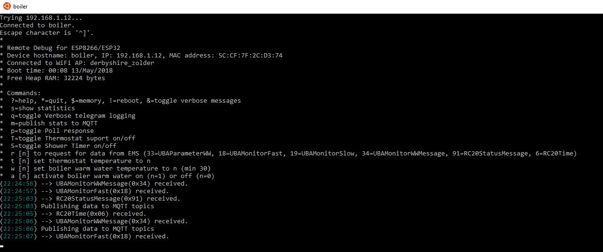
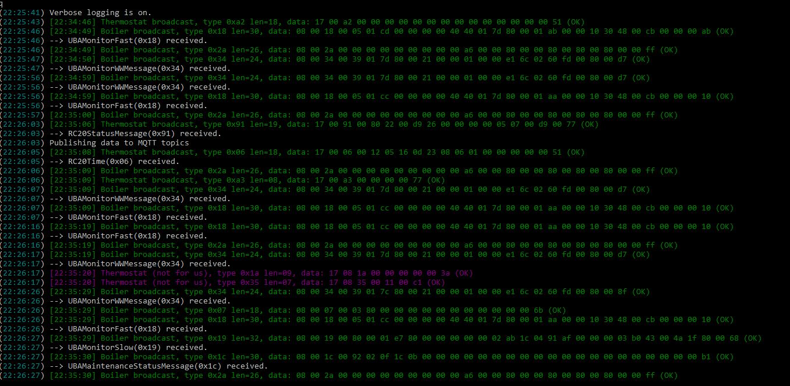
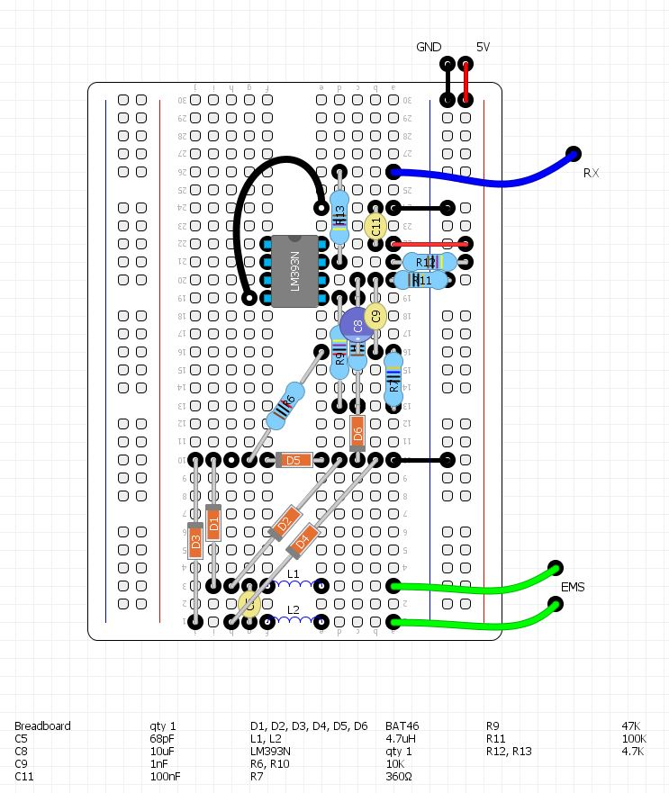
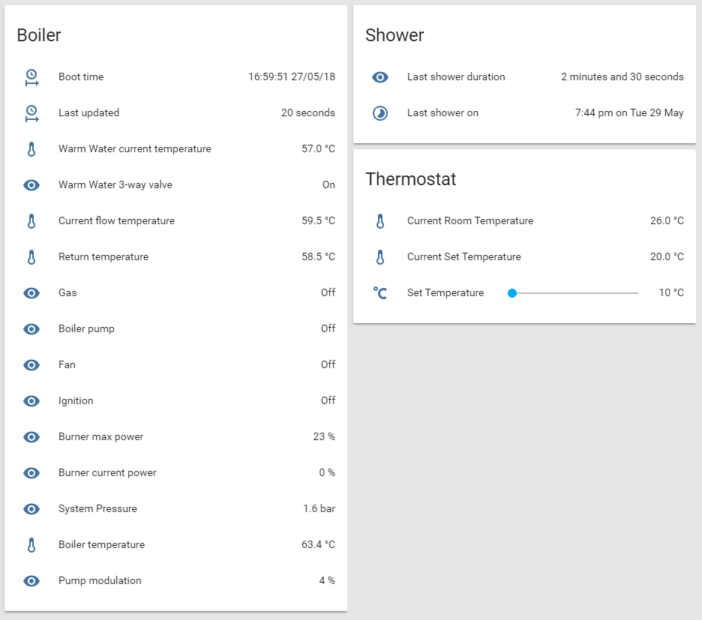

# EMS-ESP-Boiler

EMS-ESP-Boiler is an implementation of the EMS bridge protocol (Energy Management System) used in Buderus/Bosch/Nefit boilers running on an ESP8266 microcontroller. With the code and circuit design you'll be able to read values and write commands to the Boiler and any connected devices such as a thermostat. The data is collected and sent via MQTT to home automation server such as Home Assistant or Domoticz.

[](CHANGELOG.md)
[](https://github.org/xoseperez/espurna/tree/dev/)
[](LICENSE)

- [EMS-ESP-Boiler](#ems-esp-boiler)
  - [Introduction](#introduction)
  - [Which Boilers are supported?](#which-boilers-are-supported)
  - [Acknowledgments](#acknowledgments)
  - [ESP8266 device compatibility](#esp8266-device-compatibility)
  - [Getting Started](#getting-started)
  - [Debugging](#debugging)
  - [Building the Circuit](#building-the-circuit)
  - [Known Issues](#known-issues)
  - [To Do](#to-do)
  - [How the EMS works](#how-the-ems-works)
    - [1. EMS Polling](#1-ems-polling)
  - [2. EMS Broadcasting](#2-ems-broadcasting)
    - [3. EMS Sending](#3-ems-sending)
  - [The Code](#the-code)
    - [Customizing](#customizing)
    - [MQTT](#mqtt)
  - [Home Assistant Configuration](#home-assistant-configuration)
- [Building the Firmware](#building-the-firmware)
    - [Using pre-built firmware's](#using-pre-built-firmwares)
    - [Using PlatformIO](#using-platformio)
    - [Using ESPurna](#using-espurna)
    - [Your comments and feedback](#your-comments-and-feedback)


## Introduction

I originally started this project with the intention to build my own smart thermostat for my Nefit Trendline boiler and control it via [Home Assistant](https://www.home-assistant.io/). When I started deciphering the boiler EMS codes I began adding new features such as timing how long the shower was running for and triggering an alarm (actually a shot of cold water!) after a certain duration. This to the delight of my two teenage daughters :-)

## Which Boilers are supported?

Most Bosch branded boilers that support the Logamatic EMS (and EMS+) bus protocols which are Nefit, Buderus, Worcester and Junkers.

## Acknowledgments

First, a big thanks and appreciation to the following people and their projects for giving me inspiration and code snippets:

 **bbqkees** - Kees built a circuit and sample Arduino code to read from the EMS and push to Domoticz. His SMD circuit is available for purchase. Check it out at https://github.com/bbqkees/Nefit-Buderus-EMS-bus-Arduino-Domoticz

 **susisstrolch** - Probably the first working version of the EMS bridge circuit designed for the ESP8266. I borrowed Juergen's schematic and code logic. https://github.com/susisstrolch/EMS-ESP12

 **EMS Wiki** - A reference for decoding the EMS telegrams (which I found not always 100% accurate). https://emswiki.thefischer.net/doku.php?id=wiki:ems:telegramme. Use Google Translate if you can't read German.


## ESP8266 device compatibility

I've tested the code and circuit with a Wemos D1 Mini, Wemos D1 Mini Pro, Nodemcu0.9 and Nodemcu2 development boards.


## Getting Started

1. Build the circuit (or purchase a ready built one from bbqkees via his [GitHub](https://github.com/bbqkees/Nefit-Buderus-EMS-bus-Arduino-Domoticz) page or the [Domoticz forum](http://www.domoticz.com/forum/viewtopic.php?f=22&t=22079&start=20)).
2. Connect the EMS to the circuit and the RX/TX to the ESP8266 on pins D7 and D8. The EMS connection can either be the 12-15V AC direct from the EMS (split from the Thermostat if you have one) or from the Service Jack at the front. Again bbqkees has a nice explanation [here](https://github.com/bbqkees/Nefit-Buderus-EMS-bus-Arduino-Domoticz/tree/master/Documentation).
3. Optionally connect the three LEDs to show RX and TX traffic and Error codes to pins D1, D2, D3 respectively. I use 220 Ohm pull-down resistors. The pins are configurable in ``boiler.ino``. See the explanation below in the **code** section.
3. Build and upload the firmware to an ESP8266 device. Make sure you set the MQTT and WiFi credentials. If you're not using MQTT leave the MQTT_IP blank. The firmware supports OTA too and the default hostname is 'boiler' or 'boiler.' depending on the mdns resolve.
4. Power the ESP from an external 5V supply, either via USB or direct into the 5v vin pin.
5. Power the EMS circuit using the 3v3 out from the ESP8266. It will also work with 5v.
6. When it has booted, telnet (port 23) to the IP of the ESP8266. If everything is working you should see the messages appear in the window as shown below. I use Telnet client that comes with Linux distro on Windows 10 but you can also use [putty](https://www.chiark.greenend.org.uk/~sgtatham/putty/latest.html).

## Debugging

Because the Rx and Tx of the MCU is occupied with communicating to the EMS
Use the telnet client to inform you of all activity and errors if they happen. Note, if you're unable to to connect start the ESP with serial mode and look for connection errors in the serial out window.

For example:



If you hit 'q' and Enter, it will toggle verbose logging and you will see more details. I use ANSI colors with white text for info messages, green for well formatted telegram packages which the correct CRC, Red for corrupt packages and Yellow for send responses.



To see the current values of the Boiler and its parameters type 's' and hit Enter. Here it will tell you how many unsuccessful telegram packets it has received (#CrcErrors). 


You can issue commands directly to the bus using 'r' and some other examples I programmed such as:
* **r** to send a read command to a device to fetch values
* **t** set the thermostat temperature to the given value. This is also what Home Assistance uses via MQTT
* **w** to adjust the temperature of the warm water from the boiler
* **a** to turn the warm water on and off
* **p** to toggle the Polling response on/off. It's not necessary to have Polling enabled, but its the proper way
* **T** to toggle thermostat reading on/off
* **S** to toggle the Shower Timer functionality on/off

*Disclaimer: be careful when sending values to the boiler. If in doubt you can always reset the boiler to its original factory settings by following the instructions in the user guide. On my **Nefit Trendline HRC30** that is done by pressing the Home and Menu buttons simultaneously, selecting factory settings from the scroll menu and pressing the Reset button.

## Building the Circuit

The EMS circuit is really all credit to the hard work many people have done before me, noticeably *susisstrolch* with his ESP8266 [version](https://github.com/susisstrolch/EMS-ESP8266_12-PCB/tree/newmaster/Schematics/EMS-ESP8266-12).

I've included a prototype boards you can build yourself on a breadboard. One for only Reading values from the Boiler and a second with the inclusion of the Write logic to send commands.

We need the RX/TX of the ESP8266 for flashing, so the code in ``emsuart.cpp`` switches the UART pins to use RX1 and TX1 (GPIO13/D7 and GPIO15/D8 respectively). This also prevents any bogus stack data being sent to EMS bus when the ESP8266 decides to crash.

The breadboard layout was done using [DIY Layout Creator](https://github.com/bancika/diy-layout-creator) and sources files are included. It looks like:

Read Only | Both Read and Write 
--- | --- 
 | 

The schematic from Juergen which this is based off is:


**Notes:**\
*Optionally I've also added 2 polyfuses between the EMS and the Inductors which are not shown in the layout or schematics above.*

Here's a pretty rough example circuit using a NodeMcu2 with the additional LEDs and buck converter. The inputs from the EMS are not shown but there are at J60 and J58 at the bottom left.


The nicest solution ultimately is to purchase a ready made circuit from [bbqkees](http://www.domoticz.com/forum/memberlist.php?mode=viewprofile&u=1736). Here's an example of one working with a Wemos D1 Mini:


## Known Issues

* Sometimes the first write command is not sent, probably due to a collision somewhere in the UART code. The retries in the code fix that but it is annoying nevertheless.
* Sometimes you get duplicate telegrams being processed. Again, not an issue but annoying nevertheless. This is a bug somewhere in the code.

## To Do

Here's my top things I'm still working on:

* Make an ESPurna version. ESPurna takes care of the WiFi, MQTT, web server, telnet & debugging and does a better job that my modified ESPHelper code.
* Complete the ESP32 version. It's surprisingly a lot easier doing the UART code on an ESP32 with the ESP-IDF framework. The first beta version is working.
* Find a better way to control the 3-way valve to switch the warm water off quickly rather than adjusting the temperature.
* Find a stable way of powering the ESP8266 from the EMS 12V using a buck step-down converter. This does work reasonably fine on a breadboard but there is noise.


## How the EMS works

Packages are sent to the EMS "bus" from the Boiler and any other compatible connected device via serial transmission. The protocol is 9600 baud, 8N1 (8 bytes, no parity, 1 stop bit). Each package is terminated with a break signal `<BRK>` which is a 11-bit long low signal of zeros.

A package can be a single byte (see Polling below) or a string of 6 or more bytes making up an actual data telegram. A telegram is always in the format:

``[src] [dest] [type] [offset] [data] [crc] <BRK>``

I reference the first 4 bytes as the *header* in this document.

**IDs**

Each device has a unique ID.

The Boiler (MC10) has an ID of 0x08 and also referred to as the Bus Master.

My thermostat, which is a Moduline 300 uses the RC20 format and has an ID 0x17. If you're using an RC30 or RC35 type thermostat use 0x10 and make adjustments in the code as appropriate. bbqkees did a nice write-up on his github page [here](https://github.com/bbqkees/Nefit-Buderus-EMS-bus-Arduino-Domoticz/blob/master/README.md).

Our circuit acts as a service device and uses a special reserved ID of 0x0B (called a service key).

### 1. EMS Polling
The bus master (boiler) sends out a poll request every second by sending out a sequential list of all possible IDs as a single byte followed by a break signal. The ID always has its high 7th bit set so in the code we're looking for `[dest|0x80] <BRK>`.

Any connected device can respond to a Polling call with an acknowledging by sending back a single byte with its own ID. For example, in our case we would listen for a `[0x8B] <BRK>` (meaning us) and then send back `[0x0B] <BRK>` to say we're alive and ready.

Polling is also the trigger to start transmitting any packages queued for sending. It must be done within 200ms or the bus master will time out.

## 2. EMS Broadcasting

When a device is broadcasting to everyone there is no specific destination needed. `[dest]` is always 0x00.

The Boiler (ID 0x08) will send out these broadcast telegrams regularly:

Type | Description (see [here](https://emswiki.thefischer.net/doku.php?id=wiki:ems:telegramme)) | Data length (excluding header) | Frequency
--- | --- | --- | --- |
0x34 | UBAMonitorWWMessage | 19 bytes | 10 seconds
0x18 | UBAMonitorFast | 25 bytes | 10 seconds
0x19 | UBAMonitorSlow | 22 bytes | every minute
0x1c | UBAWartungsmelding | 27 bytes | every minute
0x2a | status, specific to boiler type | - | 10 seconds

And a thermostat (ID 0x17 for a RC20) would broadcast these messages regularly:

Type | Description 
--- | --- | 
0x06 | time on thermostat Y,M,H,D,M,S,wd
0xA8 | setting low, manual, clock, overrule clock setting, manual setpoint temperature
0xA3 | thermostat temperatures
0x91 | set point room temperature x 2, room temperature x 10

Refer to the code in ``ems.cpp`` for further explanation on how to parse these message types and also reference the EMS Wiki.

### 3. EMS Sending

Telegram packets can only be sent after the Boiler sends a poll to the sending device. The response can be a read command to request data or a send command to return data. At the end of the transmission a poll response is sent from the client (e.g. ``<ID> <BRK>``) to say we're all done and free up the bus for other clients.

When doing a request to read data the ``[src]`` is our device (0x0B) and the ``[dest]`` has it's 7-bit set. For example to request data from the Thermostat use ``[dest] = 0x97`` as RC20 has an ID 0x17.

When doing a write request, the 7th bit is masked in the ``[dest]``. After a write request the destination device will send either a single byte 0x01 for success or 0x04 for fail.

 ## The Code

 *Disclaimer*: This code here is really for reference only, I don't expect anyone to use as is since it's highly tailored to my environment and my needs. Most of the code however is self explanatory with comments here and there. If you wish to make some changes start with the ``defines`` and ``const`` sections at the top of ``boiler.ino``.

 The code is built on the Arduino framework as opposed to the ESP-IDF.

 These external libraries are used:
 * Time http://playground.arduino.cc/code/time
 * PubSubClient http://pubsubclient.knolleary.net
 * ArduinoJson https://github.com/bblanchon/ArduinoJson
 * Ticker https://github.com/sstaub/Ticker

 `src\emsuart.cpp` handles the low level UART read and write logic. You shouldn't need to touch this. All receive commands from the EMS bus are handled asynchronously using a circular buffer via an interrupt. A separate function processes the buffer and extracts the telegrams. Since we don't send many Write commands this is done sequentially. I couldn't use the standard Arduino Serial implementation because of the 11-bit break signal causes a frame-error which gets ignored. 
 
 `src\ems.cpp` is the logic to read the EMS packets (telegrams), validates them and process them based on the type. If you have another thermostat this is where you will configure it.

 `src\boiler.ino` is the Arduino code for the ESP8266 that kicks it all off. This is where we have specific logic such as the code to monitor and alert on the Shower timer and light up the LEDs.

 `lib\ESPHelper` is my customized version of [ESPHelper](https://github.com/ItKindaWorks/ESPHelper) with added Telnet support and some other minor tweaking.

 ### Customizing

 Most of the changes will be done in `boiler.ino` and `ems.cpp`. 
 * To add new handlers for data types, create a callback function and add to the EMS_Types at the top of the file `ems.cpp` and the new DEFINES in `ems.h`
 * To change your thermostat type set `EMS_ID_THERMOSTAT` in `ems.h`. The default is 0x17 for an RC20.
 * The DEFINES `BOILER_THERMOSTAT_ENABLED`, `BOILER_SHOWER_ENABLED` and `BOILER_SHOWER_TIMER` enabled the thermostat logic, the shower logic and the shower timer alert logic respectively. 1 is on and 0 is off.

### MQTT

When the ESP8266 boots it will send a start signal via MQTT. This is picked up by Home Assistant it sends me a notification informing me that the device has booted. Useful for knowing when the ESP gets reset - it can happen.

I'm using the standard PubSubClient client so make sure you set -DMQTT_MAX_PACKET_SIZE=512 as the default package size is 128 and our JSON messages are around 220 bytes.

I run Mosquitto on my Raspberry PI 3.

The temperature values of the thermostat are sent as a JSON object using
 `home/boiler/thermostat` and payload for example of `{"currtemp":"22.30","seltemp":"20.00"}`

The topics can be configured in the `TOPIC_*` defines in `boiler.ino`. Make sure you change the HA configuration too.

## Home Assistant Configuration

Assuming you've setup up MQTT as I did, this is what my HA configuration looks like:

**configuration.yaml**


    automation: !include automations.yaml
    input_number: !include input_number.yaml
    group: !include groups.yaml
    sensor: !include sensors.yaml


**sensors.yaml**

    - platform: mqtt
      state_topic: 'home/boiler/thermostat_currtemp'
      name: 'Boiler Thermostat Current Temperature'
      unit_of_measurement: '°C'

    - platform: mqtt
      state_topic: 'home/boiler/thermostat_seltemp'
      name: 'Boiler Thermostat Set Temperature'
      unit_of_measurement: '°C'

    - platform: template
      sensors:
        boiler_boottime:
          value_template: '{{ as_timestamp(states.automation.see_if_boiler_restarts.attributes.last_triggered) | timestamp_custom("%H:%M:%S %d/%m/%y") }}'

    - platform: mqtt
      state_topic: 'home/boiler/showertime'
      name: 'Last shower duration'
      force_update: true

    - platform: template
      sensors:
        showertime_time:
          value_template: '{{ as_timestamp(states.sensor.last_shower_duration.last_updated) | int | timestamp_custom("%-I:%M %P on %a %-d %b") }}'

    - platform: mqtt
      state_topic: 'home/boiler/boiler_data'
      name: 'Warm Water current temperature'
      unit_of_measurement: '°C'
      value_template: '{{ value_json.wWCurTmp }}' 

**automations.yaml**

    - id: thermostat_temp
      alias: 'Adjust Thermostat Temperature'
      trigger:
        platform: state
        entity_id: input_number.thermostat_temp
      action:
        service: mqtt.publish
        data_template:
          topic: 'home/boiler/thermostat_temp'
          payload: >
            {{ states.input_number.thermostat_temp.state }}

    - id: boiler_shower
      alias: Alert shower time
      trigger:
        platform: mqtt
        topic: home/boiler/showertime
      action:
        - service: notify.pushbullet
          data_template:
            title: 'Shower duration was {{trigger.payload}} at {states.sensor.time.state}}'
            message: 'Boiler'
        - service: notify.boiler_notify
          data_template:
            title: "Shower finished!"
            message: 'Shower duration was {{trigger.payload}} at {{states.sensor.time.state}}'

**input_number.yaml**

    thermostat_temp:
      name: Set thermostat temperature
      icon: mdi:temperature-celsius
      min: 10
      max: 25
      step: 0.5
      unit_of_measurement: "°C" 
      mode: slider

**groups.yaml**

    boiler:
    name: Boiler
    view: no
    entities:
       - sensor.boiler_boottime
       - sensor.warm_water_current_temperature

    shower:
    name: Shower
    view: no
    entities:
       - sensor.last_shower_duration
       - sensor.showertime_time

    thermostat:
      name: Thermostat
      view: no
      entities:
        - sensor.thermostat_current_temperature
        - sensor.thermostat_set_temperature
        - input_number.thermostat_temp

And in Home Assistant looks like:

 

 


# Building the Firmware

### Using pre-built firmware's

In the `/firmware` folder, if there are pre-built versions you can upload using esptool (https://github.com/espressif/esptool) bootloader. On Windows, follow these instructions:

1. Check if you have python 2.7 installed. If not [download it](https://www.python.org/downloads/) and make sure you add Python to the windows PATH so it'll recognize .py files.
2. Install the ESPTool by running `pip install esptool` from a command prompt.
3. Connect the ESP via USB, figure out the COM port.
4. run `esptool.py -p <com> write_flash 0x00000 <firmware>` where firmware is the .bin file and \<com\> is the com port, e.g. COM3

### Using PlatformIO

There are two ways to compile and build the firmware yourself.

The first method is a standalone version which uses a modified version of [ESPHelper](https://github.com/ItKindaWorks/ESPHelper) for the WiFi, OTA and MQTT handling. I've added some code to add a Telnet server which is useful for debugging since you can't use the serial port because UART is configured to use different pins.

To compile, using PlatformIO create a project and modify your `platformio.ini` to include these build flags:

`WIFI_SSID, WIFI_PASSWORD, MQTT_IP, MQTT_USER, MQTT_PASS`

If you're not using MQTT keep MQTT_IP empty (`MQTT_IP=""`)

Here's an example `platformio.ini` file:

```
[platformio]

[common]
framework = arduino
lib_deps =
  Time
  PubSubClient
  ArduinoJson
  Ticker

[env:nodemcuv2]
board = nodemcuv2
platform = espressif8266
framework = arduino
lib_deps = ${common.lib_deps}
upload_speed = 921600
build_flags = '-DWIFI_SSID="<my_ssid>"' '-DWIFI_PASSWORD="<my_password>"' '-DMQTT_IP="<broker_ip>"' '-DMQTT_USER="<broker_username>"' '-DMQTT_PASS="<broker_password>"'
; comment out next line if using USB and not OTA
upload_port = "boiler."
```
	
### Using ESPurna

*Note: This is still work in progress. The ESPurna code for the HTML config is still to be added* 

[ESPurna](https://github.com/xoseperez/espurna/wiki) is lovely framework that handles most of the tedious tasks of building IoT devices so you can focus on the functionality you need.

If you're using Windows follow these steps. We'll be using the free Visual Studio Code and PlatformIO. Similar steps also work on Linux distributions.

- First download Git: https://git-scm.com/download/win (install using the default settings)
- Visual Studio Code (VSC): https://code.visualstudio.com/docs/?dv=win
- Install node.js and npm (LTS version): https://nodejs.org/en/download

restart your PC to pick up the new PATH settings and start Visual Studio Code. It should now detect Git. Now go and search for and install these following VSC extensions:

- PlatformIO IDE
- GitLens

and hit **reload** to activate them all.

Next download espurna by cloning the git repository from https://github.com/xoseperez/espurna.git. Either from a terminal using 'git clone' or the GUI interface. From VSC open the folder ``espurna\code``
 - open a terminal window (ctrl-`) 
 - Install the node modules: ``npm install --only=dev``
 - Build the web interface:  ``node node_modules/gulp/bin/gulp.js``

PlatformIO should detect and set some things up for you. Build and Deploy as you normally would in PlatformIO.
 	
If you run into issues refer to official ESPurnas setup instructions [here](https://github.com/xoseperez/espurna/wiki/Build-and-update-from-Visual-Studio-Code-using-PlatformIO).
	
### Your comments and feedback

Any comments or suggestions are very welcome. You can contact me at **dev** at **derbyshire** dot **nl** or via an *Issue* in GitHub	

