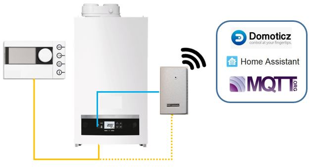
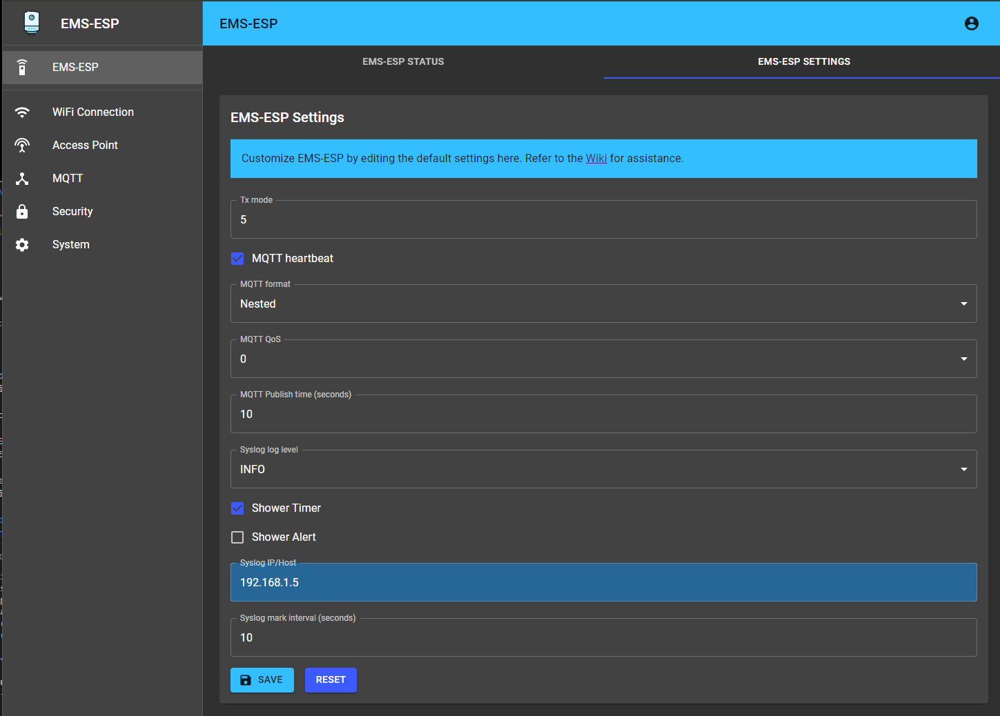
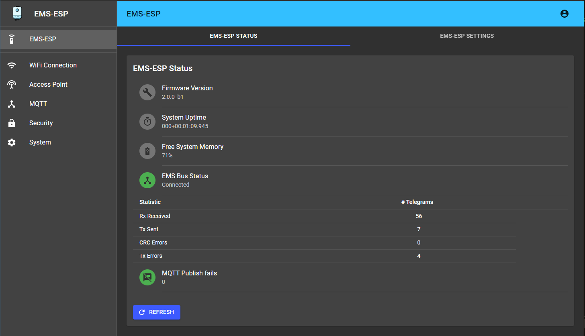
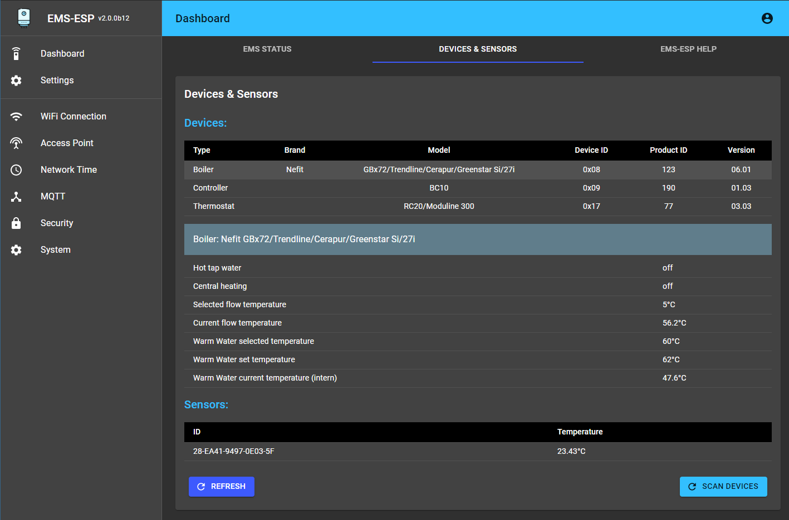
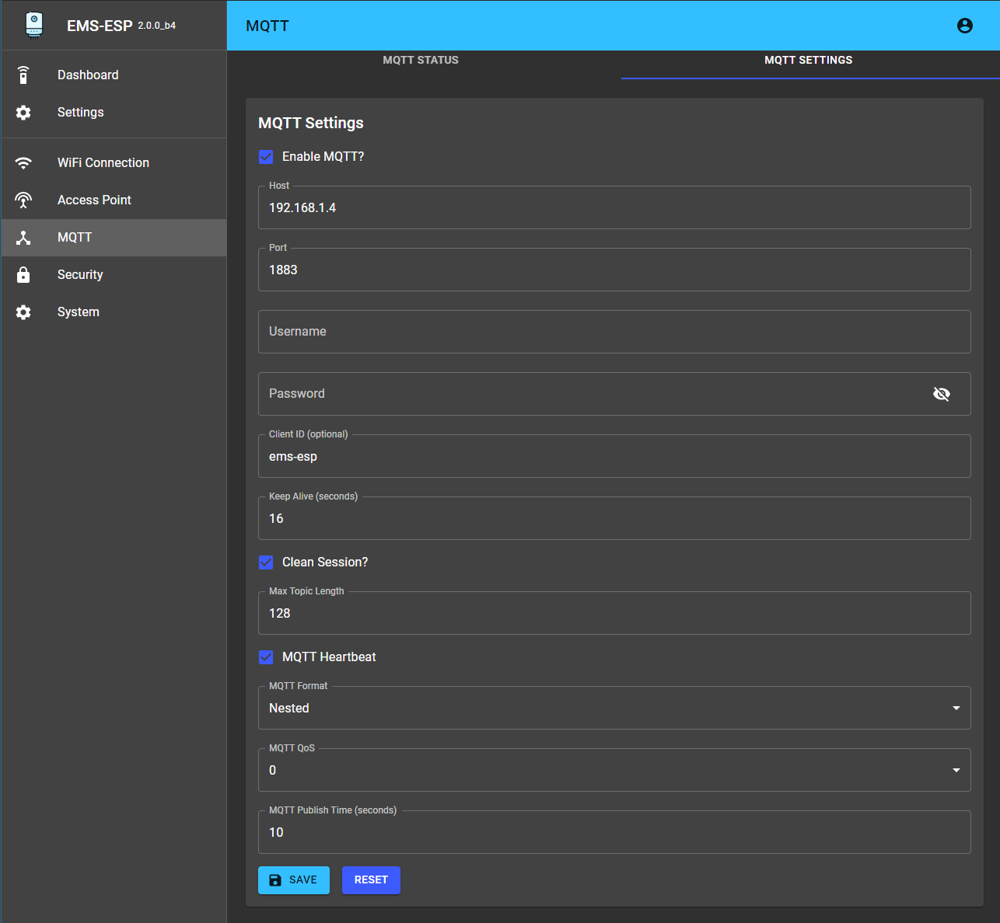
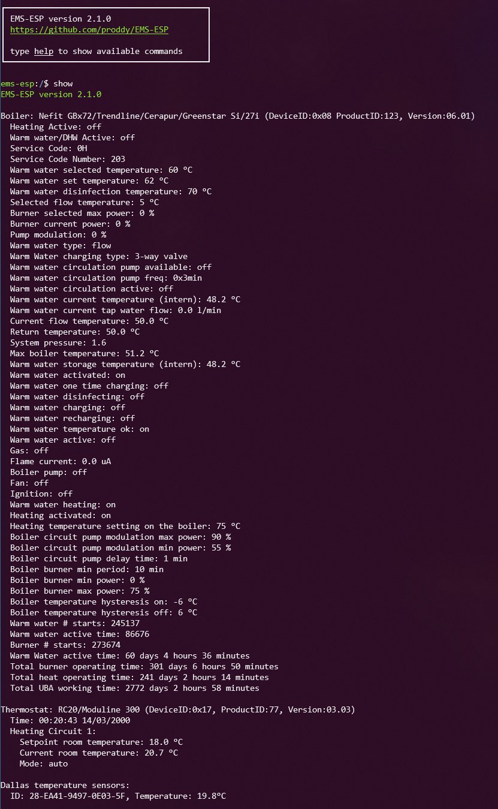
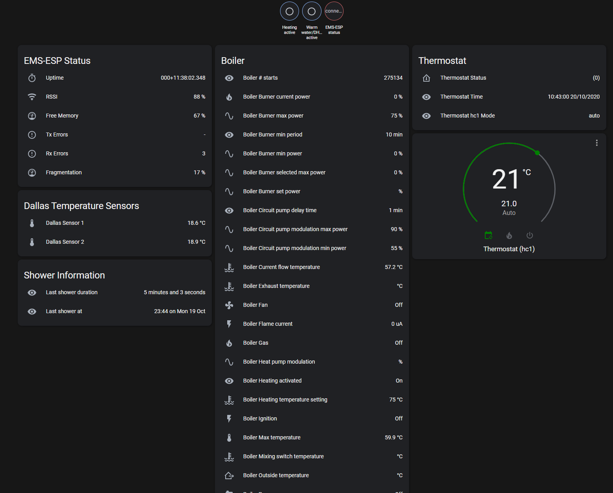

# 

**EMS-ESP** is an open-source firmware for the Espressif microcontroller that communicates with **EMS** (Energy Management System) based equipment from manufacturers like Bosch, Buderus, Nefit, Junkers, Worcester and Sieger.

This is the ESP32 version.

If you like **EMS-ESP**, please give it a star, or fork it and contribute!

Note, EMS-ESP requires a small hardware circuit that can convert the EMS bus data to be read by the microcontroller. These can be ordered at https://bbqkees-electronics.nl.

---

## **Features**

- A multi-user secure web interface to change settings and monitor the data
- A console, accessible via Serial and Telnet for more monitoring
- Native support for Home Assistant via [MQTT Discovery](https://www.home-assistant.io/docs/mqtt/discovery/)
- Can run standalone as an independent WiFi Access Point or join an existing WiFi network
- Easy first-time configuration via a web Captive Portal
- Support for more than [70 EMS devices](https://emsesp.github.io/docs/#/Supported-EMS-Devices) (boilers, thermostats, solar modules, mixer modules, heat pumps, gateways)
  
## **Screenshots**

### Web Interface:

| | |
| --- | --- |
|  |  |
|  |  |

### Telnet Console:

### In Home Assistant:

  
## **Installing**

Refer to the [official documentation](https://emsesp.github.io/docs) to how to install the firmware and configure it. The documentation is being constantly updated as new features and settings are added.

You can choose to use an pre-built firmware image or compile the code yourself:

* [Uploading a pre-built firmware build](https://emsesp.github.io/docs/#/Uploading-firmware)
* [Building the firmware from source code and flashing manually](https://emsesp.github.io/docs/#/Building-firmware)

## **Support Information**

If you're looking for support on **EMS-ESP** there are some options available:

### Documentation

* [Official EMS-ESP Documentation](https://emsesp.github.io/docs): For information on how to build and upload the firmware
* [FAQ and Troubleshooting](https://emsesp.github.io/docs/#/Troubleshooting): For information on common problems and solutions. See also [BBQKees's wiki](https://bbqkees-electronics.nl/wiki/gateway/troubleshooting.html)

### Support Community

* [Discord Server](https://discord.gg/3J3GgnzpyT): For support, troubleshooting and general questions. You have better chances to get fast answers from members of the community
* [Search in Issues](https://github.com/proddy/EMS-ESP/issues): You might find an answer to your question by searching current or closed issues

### Developer's Community

* [Bug Report](https://github.com/proddy/EMS-ESP/issues/new?template=bug_report.md): For reporting Bugs
* [Feature Request](https://github.com/proddy/EMS-ESP/issues/new?template=feature_request.md): For requesting features/functions
* [Troubleshooting](https://github.com/proddy/EMS-ESP/issues/new?template=questions---troubleshooting.md): As a last resort, you can open new *Troubleshooting & Question* issue on GitHub if the solution could not be found using the other channels. Just remember: the more info you provide the more chances you'll have to get an accurate answer

## **Contributing**

You can contribute to EMS-ESP by
- providing Pull Requests (Features, Fixes, suggestions)
- testing new released features and report issues on your EMS equipment
- contributing to missing [Documentation](https://emsesp.github.io/docs)

## **Credits**

A shout out to the people helping EMS-ESP get to where it is today...
- **@MichaelDvP** for all his amazing contributions and patience. Specifically for the improved uart library, thermostat and mixer logic.
- **@BBQKees** for his endless testing and building the awesome circuit boards
- **@rjwats** for his [esp8266-react](https://github.com/rjwats/esp8266-react) framework that provides the new Web UI
- **@nomis** for his core [console](https://github.com/nomis/mcu-uuid-console), telnet and syslog core libraries  
- plus everyone else providing suggestions, PRs and the odd donation that keeps this project open source. Thanks!

## **License**

This program is licensed under GPL-3.0
