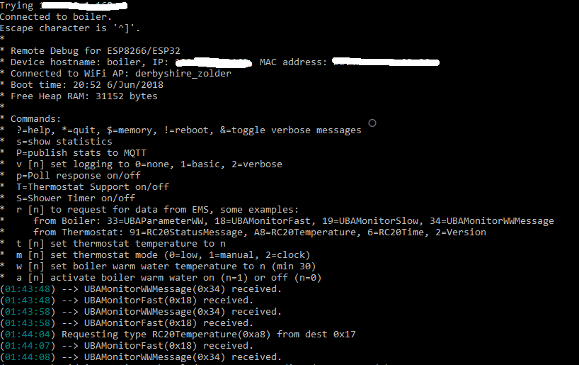
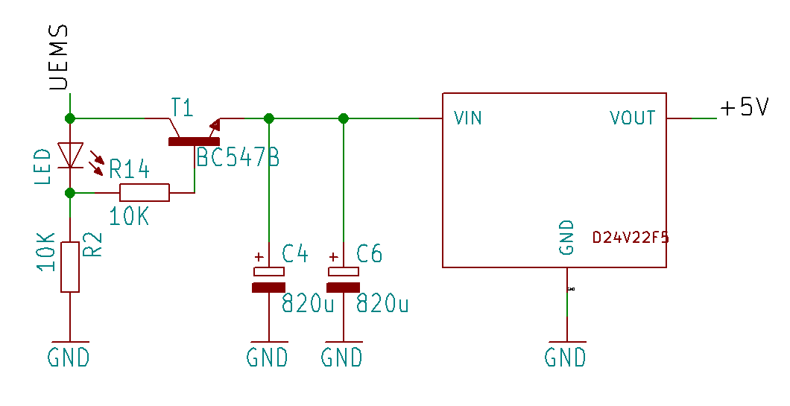
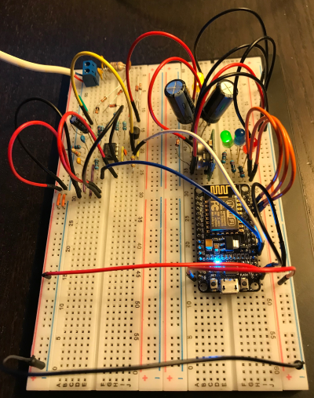
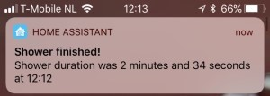

# EMS-ESP-Boiler

EMS-ESP-Boiler is an controller running on an ESP8266 to communicate with EMS (Energy Management System) based Boilers from the Bosch range. This includes the Buderus and Nefit ranger of boilers, heaters and thermostats.

There are 3 parts to this project, first the design of the circuit, second the code to deploy to an ESP8266 based microcontroller and lastly settings for Home Assistant to monitor data and issue direct commands via MQTT.

[](CHANGELOG.md)
[](https://github.org/xoseperez/espurna/tree/dev/)
[](LICENSE)

- [EMS-ESP-Boiler](#ems-esp-boiler)
  - [Introduction](#introduction)
  - [Supported Boilers types](#supported-boilers-types)
  - [Supported ESP8266 devices](#supported-esp8266-devices)
  - [Getting Started](#getting-started)
  - [Debugging the output](#debugging-the-output)
  - [Building the circuit](#building-the-circuit)
    - [Powering the circuit](#powering-the-circuit)
  - [How the EMS works](#how-the-ems-works)
    - [EMS IDs](#ems-ids)
    - [EMS Polling](#ems-polling)
    - [EMS Broadcasting](#ems-broadcasting)
    - [EMS Reading and Writing](#ems-reading-and-writing)
  - [The Code](#the-code)
    - [The supported EMS Types](#the-supported-ems-types)
    - [Customizing](#customizing)
    - [Using MQTT](#using-mqtt)
    - [The basic Shower logic](#the-basic-shower-logic)
  - [Home Assistant Configuration](#home-assistant-configuration)
    - [configuration.yaml](#configurationyaml)
    - [sensors.yaml](#sensorsyaml)
    - [automations.yaml](#automationsyaml)
    - [input_number.yaml](#input-numberyaml)
    - [groups.yaml](#groupsyaml)
  - [Building the firmware](#building-the-firmware)
    - [Using PlatformIO Standalone](#using-platformio-standalone)
    - [Using ESPurna](#using-espurna)
    - [Using the pre-built firmware's](#using-the-pre-built-firmwares)
    - [Using the Arduino IDE](#using-the-arduino-ide)
  - [Known Issues and ToDo's](#known-issues-and-todos)
  - [Your comments and feedback](#your-comments-and-feedback)

## Introduction

My original intention for this home project with to build my own smart thermostat for my Nefit Trendline boiler and then have it controlled via [Home Assistant](https://www.home-assistant.io/) on my mobile phone. I had a few ESP32s and ESP8266s lying around from previous IoT projects and building a specific circuit to decode the EMS messages was a nice challenge into more complex electronic circuits. I then began adding new features such as timing how long the shower was running for and triggering an alarm (actually a shot of cold water!) after a certain duration.

Acknowledgments and muchos kudos to the following people and their open-sourced projects:

 **susisstrolch** - Probably the first working version of the EMS bridge circuit I could find designed for the ESP8266. I borrowed Juergen's [schematic](https://github.com/susisstrolch/EMS-ESP12) and parts of his code logic.

 **bbqkees** - Kees built a [circuit](https://github.com/bbqkees/Nefit-Buderus-EMS-bus-Arduino-Domoticz) and wrote some sample Arduino code to read from the EMS and push messages to Domoticz. His SMD board is also available to purchase from him directly.

 **EMS Wiki** - A comprehensive [reference](https://emswiki.thefischer.net/doku.php?id=wiki:ems:telegramme) for decoding the EMS telegrams, which I found not always to be 100% accurate. It's in German so use Google Translate if you need help.

## Supported Boilers types

Most Bosch branded boilers that support the Logamatic EMS (and EMS+) bus protocols work with this design. Which are Nefit, Buderus, Worcester and Junkers and copyrighted.

## Supported ESP8266 devices

I've tested the code and circuit with a few ESP8266 development boards such as the Wemos D1 Mini, Wemos D1 Mini Pro, Nodemcu0.9 and Nodemcu2 boards. It will also work on bare ESP8266 chips such as the 12s but do make sure you disabled the LED support and wire the UART correctly as this is switched (explained below).

## Getting Started

1. Either build the circuit below or purchase a ready built board from bbqkees via his [GitHub](https://github.com/bbqkees/Nefit-Buderus-EMS-bus-Arduino-Domoticz) page or the [Domoticz forum](http://www.domoticz.com/forum/viewtopic.php?f=22&t=22079&start=20).
2. Get an ESP8266 dev board and connect the 2 EMS output lines from the boiler to the circuit and the Rx/Tx out to pins D7 and D8 on the ESP. The EMS connection can either be the 12-15V AC direct from the thermostat bus line or from the 3.5" Service Jack at the front. Again bbqkees has a nice explanation [here](https://github.com/bbqkees/Nefit-Buderus-EMS-bus-Arduino-Domoticz/tree/master/Documentation).
3. Optionally connect the three LEDs to show Rx and Tx traffic and Error codes to pins D1, D2, D3 respectively. I use 220 Ohm pull-down resistors. These pins are configurable in ``boiler.ino``. This is furtherr explained in the **code** section below.
4. Build and upload the firmware to the ESP8266 device. I used Platformio with Visual Studio. Do make sure you set the MQTT and WiFi credentials correctly and if you're not using MQTT leave the MQTT_IP blank. The firmware supports OTA too with the default hostname as 'boiler' (or 'boiler.' depending on your OS and how the mdns resolves hostnames).
5. Power the ESP either via USB or direct into the 5v vin pin from an external power 5V volts supply with min 400mA.
6. Attach the 3v3 out on the ESP8266 to the DC power line on the EMS circuit as indicated in the schematics.
7. When your ESP device has booted, telnet (port 23) to the IP. If using DHCP figure the IP out or use USB and the serial terminal on the COM port to see. If everything is working you should see the messages appear in the window as shown in the next section. I use a Telnet client that comes with Linux distro on Windows 10 in developer mode but you can also use [putty](https://www.chiark.greenend.org.uk/~sgtatham/putty/latest.html) or any other software.

## Debugging the output

Use the telnet client to inform you of all activity and errors real-time. This is an example of the telnet output:



If you hit 'q' and Enter, it will toggle verbose logging showing you more detailed messages. I use ANSI colors with white text for info messages, green for well formatted telegram packages (which have validated CRC checks), red for corrupt packages and yellow for send responses.


To see the current values of the Boiler and its parameters type 's' and hit Enter. Watch out for unsuccessful telegram packets in the #CrcErrors line.


Commands can be issued directly to the EMS bus typing in a letter followed by an optional parameter and pressing Enter. Supported commands are:

- **r** to send a read command to all devices to fetch values. The 2nd parameter is the type. For example 'r 33' will request type UBAParameterWW and bring back the Warm Water temperatures (not the heating) from the Boiler. You can issue any type here.
- **t** set the thermostat temperature to the given value
- **w** to adjust the temperature of the warm water from the boiler
- **a** to turn the warm water on and off
- **p** to toggle the Polling response on/off. It's not necessary to have Polling enabled to work. I use this for debugging purposes.
- **m** to set the thermostat mode from low, manual and clock/auto.
- **T** to toggle thermostat reading on/off
- **S** to toggle the Shower Timer functionality on/off

**Disclaimer: be careful when sending values to the boiler. If in doubt you can always reset the boiler to its original factory settings by following the instructions in the user guide. On my **Nefit Trendline HRC30** that is done by pressing the Home and Menu buttons simultaneously, selecting factory settings from the scroll menu and lastly pressing the Reset button.**

## Building the circuit

The EMS circuit is really all credit to the hard work many people have done before me, noticeably *susisstrolch* with his ESP8266 [version](https://github.com/susisstrolch/EMS-ESP8266_12-PCB/tree/newmaster/Schematics/EMS-ESP8266-12).

I've included a prototype boards you can build yourself on a breadboard. One part for only reading values from the Boiler and an extension with the write logic so you can also send commands.

We need the Rx/Tx of the ESP8266 for flashing, so the code in ``emsuart.cpp`` switches the UART pins to use RX1 and TX1 (GPIO13/D7 and GPIO15/D8 respectively). This also prevents any bogus stack data being sent to EMS bus when the ESP8266 decides to crash like after a Watch Dog Reset.

The breadboard layout was done using [DIY Layout Creator](https://github.com/bancika/diy-layout-creator) and sources files are included in this repo.


The schematic used (as designed by [susisstrolch](https://github.com/susisstrolch/EMS-ESP8266_12-PCB)):


*Optionally I've also added 2 0.5A/72V polyfuses between the EMS and the two inductors L1 and L2 for extra protection.*

And lastly if you don't fancy building the circuit, [bbqkees](http://www.domoticz.com/forum/memberlist.php?mode=viewprofile&u=1736) can sell you one complete with SMD components which looks like the photo below when connected to a Wemos D1 Mini:


### Powering the circuit

My circuit will work with both 3.3V and 5V. It's easiest though to power directly from the ESP's 3V3 line.

Powering the ESP89266 can be either via the USB from a PC or external 5V power supply or from the EMS itself using a buck step-down converter. The EMS provides about a 15V AC current direct from the EMS line, or around 12V from the 3.5" service jack. The advantage of using the EMS for power is obviously the exclusion of an external power adapter and you can place the small circuit in line with the thermostat tucked away close to the boiler. The circuit's bridge rectifier will produce about 14.5V DC at UEMS (see schematic). I use a [Pololu D24C22F5](https://www.pololu.com/product/2858) which is 5V/2A buck step-down module and probably slightly overkill for what we need. The additional part of the circuit is shown below along with an earlier breadboard prototype using a NodeMCU2 (with the additional LEDs):

| Power circuit                              | Example                                              |
| ------------------------------------------ | ---------------------------------------------------- |
|  |  |

## How the EMS works

Packages are sent to the EMS "bus" from the Boiler and any other compatible connected devices via serial TTL transmission. The protocol is 9600 baud, 8N1 (8 bytes, no parity, 1 stop bit). Each package is terminated with a break signal `<BRK>`, a 11-bit long low signal of zeros.

A package can be a single byte (see Polling below) or a string of 6 or more bytes making up an actual data telegram. A telegram is always in the format:

``[src] [dest] [type] [offset] [data] [crc] <BRK>``

I reference the first 4 bytes as the *header* in this document.

### EMS IDs

Each device has a unique ID.

The Boiler has an ID of 0x08 (type MC10) and also referred to as the Bus Master or UBA.

My thermostat, which is a* Moduline 300* uses the RC20 protocol and has an ID 0x17. If you're using an RC30 or RC35 type thermostat such as the newer Moduline 300s or 400s use 0x10 and make adjustments in the code as appropriate. bbqkees did a nice write-up on his github page [here](https://github.com/bbqkees/Nefit-Buderus-EMS-bus-Arduino-Domoticz/blob/master/README.md).

Our circuit acts as a service key and thus uses an ID 0x0B. This ID is reserved for special devices intended for installation engineers for maintenance work.

### EMS Polling

The bus master (boiler) sends out a poll request every second by sending out a sequential list of all possible IDs as a single byte followed by the break signal. The ID always has its high 7th bit set so in the code we're looking for 1 byte messages matching the format `[dest|0x80] <BRK>`.

Any connected device can respond to a Polling call with an acknowledging by sending back a single byte with its own ID. In our case we would listen for a `[0x8B] <BRK>` (meaning us) and then send back `[0x0B] <BRK>` to say we're alive and ready.

Polling is also the trigger to start transmitting any packages queued for sending. It must be done within 200ms or the bus master will time out.

### EMS Broadcasting

When a device is broadcasting to everyone there is no specific destination needed. `[dest]` is always 0x00.

The Boiler (ID 0x08) will send out these broadcast telegrams regularly:

| Type | Description (see [here](https://emswiki.thefischer.net/doku.php?id=wiki:ems:telegramme)) | Data length (excluding header) | Frequency    |
| ---- | ---------------------------------------------------------------------------------------- | ------------------------------ | ------------ |
| 0x34 | UBAMonitorWWMessage                                                                      | 19 bytes                       | 10 seconds   |
| 0x18 | UBAMonitorFast                                                                           | 25 bytes                       | 10 seconds   |
| 0x19 | UBAMonitorSlow                                                                           | 22 bytes                       | every minute |
| 0x1C | UBAWartungsmelding                                                                       | 27 bytes                       | every minute |
| 0x2A | status, specific to boiler type                                                          | -                              | 10 seconds   |

And a thermostat (ID 0x17 for a RC20) would broadcast these messages regularly:

| Type | Description                                       | Frequency    |
| ---- | ------------------------------------------------- | ------------ |
| 0x06 | RC20Time - time on thermostat Y M H D M S weekday | every minute |
| 0x91 | RC20StatusMessage -                               | every minute |

Refer to the code in `ems.cpp` for further explanation on how to parse these message types and also reference the EMS Wiki.

### EMS Reading and Writing

Telegram packets can only be sent after the Boiler sends a poll to the sending device. The response can be a read command to request data or a write command to send data. At the end of the transmission a poll response is sent from the client (`<ID> <BRK>`) to say we're all done and free up the bus for other clients.

When doing a request to read data the `[src]` is our device (0x0B) and the `[dest]` has it's 7-bit set. Say we were requesting data from the thermostat we would use `[dest] = 0x97` since RC20 has an ID of 0x17.

When doing a write request, the 7th bit is masked in the `[dest]`. After this write request the destination device will send either a single byte 0x01 for success or 0x04 for fail.

Every telegram sent is echo'd back to Rx.

## The Code

*Disclaimer*: This code here is really for reference only, I don't expect anyone to use as is since it's highly tailored to my environment and my needs. Most of the code however is self explanatory with comments here and there. If you wish to make some changes start with the `defines` and `const` sections at the top of `boiler.ino`.

The code is built on the Arduino framework and is dependent on these external libraries:

- Time http://playground.arduino.cc/code/time
- PubSubClient http://pubsubclient.knolleary.net
- ArduinoJson https://github.com/bblanchon/ArduinoJson

`emsuart.cpp` handles the low level UART read and write logic. You shouldn't need to touch this. All receive commands from the EMS bus are handled asynchronously using a circular buffer via an interrupt. A separate function processes the buffer and extracts the telegrams. Since we don't send too many write commands this is done sequentially. I couldn't use the standard Arduino Serial implementation because of the 11-bit break signal causes a frame-error which gets ignored.

`ems.cpp` is the logic to read the EMS packets (telegrams), validates them and process them based on the type.

`boiler.ino` is the Arduino code for the ESP8266 that kicks it all off. This is where we have specific logic such as the code to monitor and alert on the Shower timer and light up the LEDs. LED support is enabled by setting the -DUSE_LED build flag.

`ESPHelper.cpp` is my customized version of [ESPHelper](https://github.com/ItKindaWorks/ESPHelper) with added Telnet support and some other minor tweaking.

### The supported EMS Types

`ems.cpp` defines callback functions that handle all the broadcast types listed above (e.g. 0x34, 0x18, 0x19 etc) plus these extra types:

| Device            | Type | Description                   | What                                     |
| ----------------- | ---- | ----------------------------- | ---------------------------------------- |
| Boiler (0x08)     | 0x33 | UBAParameterWW                | reads selected & desired warm water temp |
| Boiler (0x08)     | 0x14 | UBATotalUptimeMessage         |                                          |
| Boiler (0x08)     | 0x15 | UBAMaintenanceSettingsMessage |                                          |
| Boiler (0x08)     | 0x16 | UBAParametersMessage          |                                          |
| Thermostat (0x17) | 0xA8 | RC20Temperature               | sets temperature and operating modes     |
| Thermostat (0x17) | 0xA3 | RCOutdoorTempMessage          |                                          |
| Thermostat (0x17) | 0x91 | RC20StatusMessage             | reads set & current room temperatures    |
| Thermostat (0x17) | 0x02 | Version                       | reads Version major/minor                |

Note the thermostat types are based on a RC20 model thermostat. If using an RC30/RC35 use types 0x3E and 0x48 to read the values.

### Customizing

Most of the changes will be done in `boiler.ino` and `ems.cpp`.

- To add new handlers for data types, first create a callback function and add to the `EMS_Types` at the top of the file `ems.cpp` and modify `ems.h`
- To change your thermostat type set `EMS_ID_THERMOSTAT` in `ems.cpp`. The default is 0x17 for an RC20.
- The DEFINES `BOILER_THERMOSTAT_ENABLED`, `BOILER_SHOWER_ENABLED` and `BOILER_SHOWER_TIMER` enabled the thermostat logic, the shower logic and the shower timer alert logic respectively. 1 is on and 0 is off.

### Using MQTT

When the ESP8266 boots it will send a start signal via MQTT. This is picked up by Home Assistant and sends a notification informing me that the device has booted. Useful for knowing when the ESP gets reset.

I'm using the standard PubSubClient client so make sure you set `-DMQTT_MAX_PACKET_SIZE=300` as the default package size is 128 and our JSON messages are around 220 bytes.

I run Mosquitto on my Raspberry PI 3 as the MQTT broker.

The boiler data is collected and sent as a single JSON object to MQTT TOPIC `home/boiler/boiler_data`. Example payload:

`{"wWCurTmp":"43.0","wWHeat":"on","curFlowTemp":"51.7","retTemp":"48.0","burnGas":"off","heatPmp":"off","fanWork":"off","ignWork":"off","wWCirc":"off","selBurnPow":"0","curBurnPow":"0","sysPress":"1.6","boilTemp":"54.7","pumpMod":"4"}`

The temperature values of the thermostat as two separate topics `home/boiler/thermostat_currtemp` and `home/boiler/thermostat_seltemp`

Values sent from HA to set the temperature come in via the subscribed topic `home/boiler/thermostat_temp`

These topics can be configured in the `TOPIC_*` defines in `boiler.ino`. Make sure you change the HA configuration too to match.

### The basic Shower logic

Checking whether the shower is running was tricky. We know when the warm water is on and being heated but need to distinguish between the central heating, shower, hot tap and bath. I found via trial and error the Selected Burner Max Power is between 80% and 115% when the shower is running and fixed at 75% if the central heating is on. Furthermore the Selected Flow Impulsion is 80 C for the heating.

There is other logic in the code to compensate for ramp up and whether the shower is turned off and back on again quickly within a 10 second window.

## Home Assistant Configuration

This is what my HA configuration looks like:

### configuration.yaml

    ...
    automation: !include automations.yaml
    input_number: !include input_number.yaml
    group: !include groups.yaml
    sensor: !include sensors.yaml

### sensors.yaml

    - platform: mqtt
      state_topic: 'home/boiler/thermostat_currtemp'
      name: 'Current Room Temperature'
      unit_of_measurement: '°C'

    - platform: mqtt
      state_topic: 'home/boiler/thermostat_seltemp'
      name: 'Current Set Temperature'
      unit_of_measurement: '°C'

    - platform: mqtt
      state_topic: 'home/boiler/showertime'
      name: 'Last shower duration'
      force_update: true

    - platform: template
      sensors:
        showertime_time:
          value_template: '{{ as_timestamp(states.sensor.last_shower_duration.last_updated) | int | timestamp_custom("%-I:%M %P on %a %-d %b") }}'

    - platform: mqtt
      state_topic: 'home/boiler/boiler_data'
      name: 'Warm Water current temperature'
      unit_of_measurement: '°C'
      value_template: '{{ value_json.wWCurTmp }}'

      ..etc..etc

### automations.yaml

    - id: thermostat_temp
      alias: 'Adjust Thermostat Temperature'
      trigger:
        platform: state
        entity_id: input_number.thermostat_temp
      action:
        service: mqtt.publish
        data_template:
          topic: 'home/boiler/thermostat_temp'
          payload: >
            {{ states.input_number.thermostat_temp.state }}

    - id: boiler_shower
      alias: Alert shower time
      trigger:
        platform: mqtt
        topic: home/boiler/showertime
      action:
        - service: notify.boiler_notify
          data_template:
            title: "Shower finished!"
            message: 'Shower duration was {{trigger.payload}} at {{states.sensor.time.state}}'

### input_number.yaml

    thermostat_temp:
      name: Set thermostat temperature
      icon: mdi:temperature-celsius
      min: 10
      max: 25
      step: 0.5
      unit_of_measurement: "°C"
      mode: slider

### groups.yaml

    boiler:
    name: Boiler
    view: no
    entities:
       - sensor.boiler_boottime
       - sensor.warm_water_current_temperature
       ..etc..etc..

    shower:
    name: Shower
    view: no
    entities:
       - sensor.last_shower_duration
       - sensor.showertime_time

    thermostat:
      name: Thermostat
      view: no
      entities:
        - sensor.current_room_temperature
        - sensor.current_set_temperature
        - input_number.thermostat_temp

And in Home Assistant looks like:




## Building the firmware

### Using PlatformIO Standalone

PlatformIO is my preferred way. The code uses a modified version [ESPHelper](https://github.com/ItKindaWorks/ESPHelper) which handles all the basic handling of the WiFi, MQTT, OTA and Telnet server. I switched from Atom to the marvelous Visual Studio Code, works on Windows, OSX and Linux.

Roughly these are the steps needed when running Windows:

- First download [Git](https://git-scm.com/download/win) (install using the default settings)
- Download and install [Visual Studio Code](https://code.visualstudio.com/docs/?dv=win) (VSC)
- Restart the PC (if using Windows) to apply the new PATH settings. It should now detect Git
- Install these VSC extensions: PlatformIDE and GitLens, the reload to activate them
- Git clone this repo, eith using `git clone` from PlatformIO's terminal or the Git GUI interface
- Create a `platformio.ini` based on my `platformio.ini-example` making the necessary changes for your WiFi and MQTT credentials in the build flags. If you're not using MQTT leave MQTT_IP empty (`MQTT_IP=""`)

### Using ESPurna

*Note: This is still work in progress. The ESPurna code for the HTML config is still to be added.*
[ESPurna](https://github.com/xoseperez/espurna/wiki) is framework that handles most of the tedious tasks of building IoT devices so you can focus on the functionality you need. This replaces my ESPHelper code in the standalone version above. ESPurna is built on PlatformIO and Visual Studio Code too. Follow these steps:

- Download and install [NodeJS and npm](https://nodejs.org/en/download). Choose the LTS version.
- Download espurna by cloning the ESPurna git repository from `https://github.com/xoseperez/espurna.git`.
- Restart VSC. PlatformIO should detect and set some things up for you automagically.
- From VSC open the folder ``espurna\code``
- open a terminal window (ctrl-`)
- Install the node modules: ``npm install --only=dev``
- Build the web interface:  ``node node_modules/gulp/bin/gulp.js``
- Finally copy the files `custom.h, index.html, boiler.ino and the esp*.cpp/h` files from the `espurna` directory in this repo to the code directory and build.

If you run into issues refer to official ESPurnas setup instructions [here](https://github.com/xoseperez/espurna/wiki/Build-and-update-from-Visual-Studio-Code-using-PlatformIO).

### Using the pre-built firmware's

I will eventually put pre-built version based on ESPurna in the directory `/firmware` which you can upload using [esptool](https://github.com/espressif/esptool) bootloader. On Windows, follow these instructions:

1. Check if you have python 2.7 installed. If not [download it](https://www.python.org/downloads/) and make sure you select the option to add Python to the windows PATH.
2. Install the ESPTool by running `pip install esptool` from a command prompt.
3. Connect the ESP via USB, figure out the COM port.
4. run `esptool.py -p <com> write_flash 0x00000 <firmware>` where firmware is the `.bin` file and \<com\> is the COM port, e.g. `COM3`

### Using the Arduino IDE

Porting to the Arduino IDE can be a little tricky but it is possible.

- Add the ESP8266 boards (from Preferences add Additional Board URL `http://arduino.esp8266.com/stable/package_esp8266com_index.json`)
- Go to Boards Manager and install ESP8266 2.4.x platform
- Select your ESP8266 from Tools->Boards and the correct port with Tools->Port
- From the Library Manager install ArduinoJson 5.13.x, PubSubClient 2.6.x and Time
- The Arduino IDE doesn't have a common way to set build flags (ugh!) so you'll need to un-comment these lines in `boiler.ino`:

```c
#define WIFI_SSID "<my_ssid>"
#define WIFI_PASSWORD "<my_password>"
#define MQTT_IP "<broker_ip>"
#define MQTT_USER "<broker_username>"
#define MQTT_PASS "<broker_password>"
```

- Put all the files in a single sketch folder (`ESPHelper.*, boiler.ino, ems.*, emsuart.*`)
- cross your fingers and hit CTRL-R to compile...

## Known Issues and ToDo's

Some annoying issues that need fixing:

- Very infrequently an EMS write command is not sent, probably due to a collision somewhere in the UART between an incoming Rx and a Poll. The retries in the code fix this for now.
- I've seen a few duplicate telegrams being processed. Again, it's harmless and not a big issue, but still a bug.

Here's my top things I'm still working on:

- Make an ESPurna version. ESPurna is a lovely framework that takes care of the WiFi, MQTT, web server, telnet & debugging.
- Complete the ESP32 version. It's surprisingly a lot easier doing the UART handling on an ESP32 with the ESP-IDF SDK. I have a first version beta that is working.
- Find a better way to control the 3-way valve to switch the warm water off quickly rather than deactivating the warm water heater each time. There is an unsupported call to do this, but I think its too risky and experimental. I'd love to get my hands on an Nefit Easy, sniff the packets being sent and reverse engineer the logic. Anyone help?

## Your comments and feedback

Any comments, suggestions or code changes are very welcome.

You can contact me at **dev** at **derbyshire** dot **nl** or by posting a GitHub issue.
