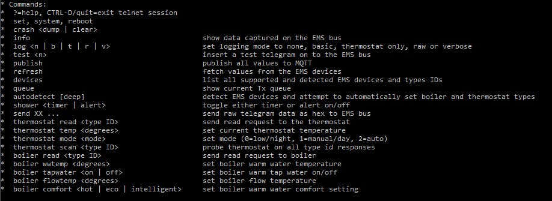
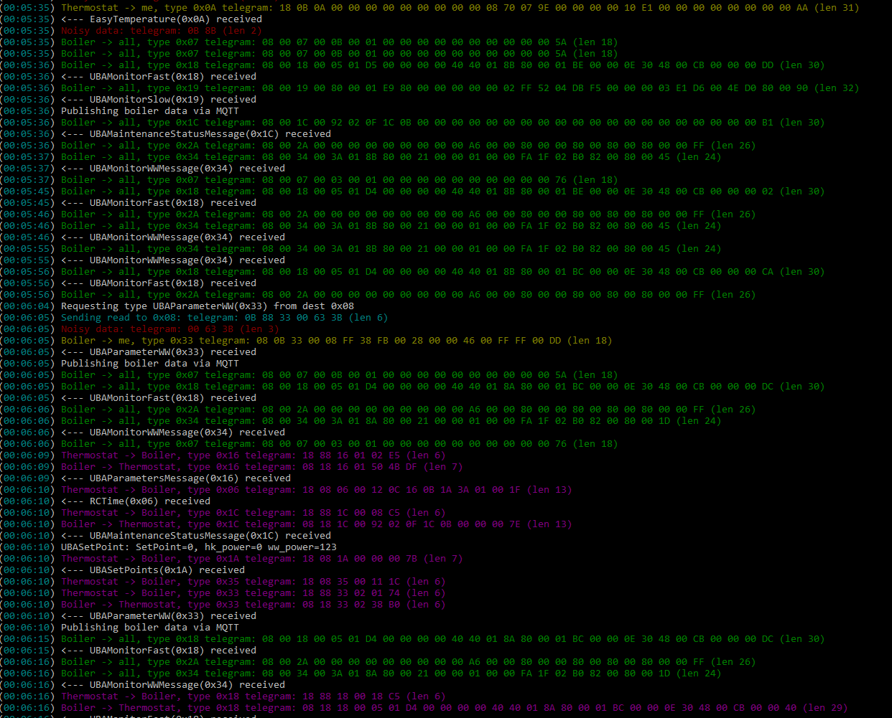
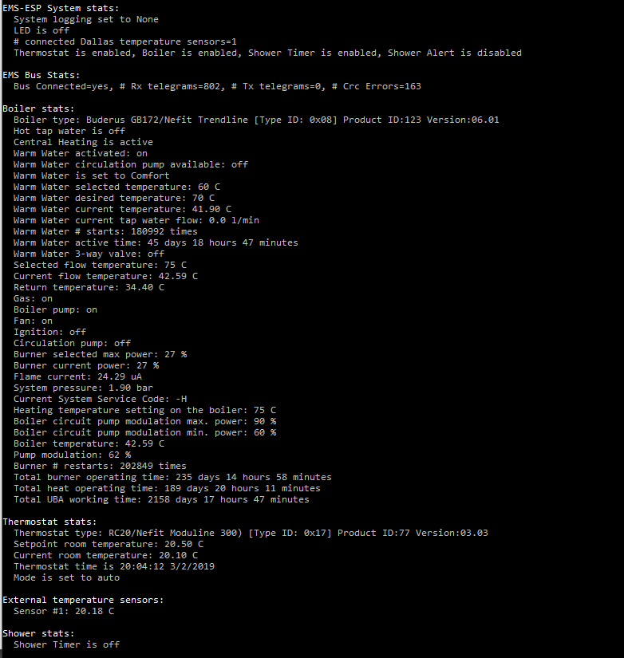
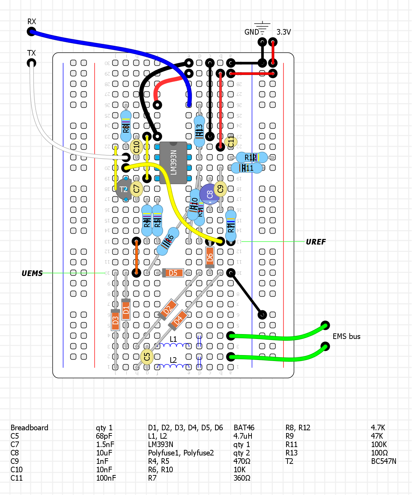
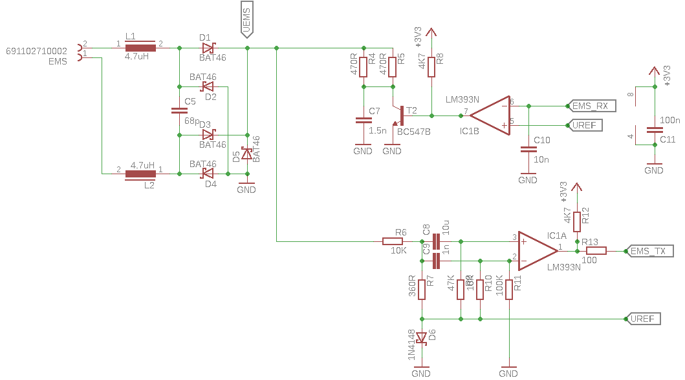
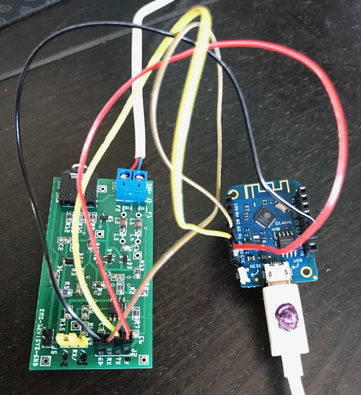
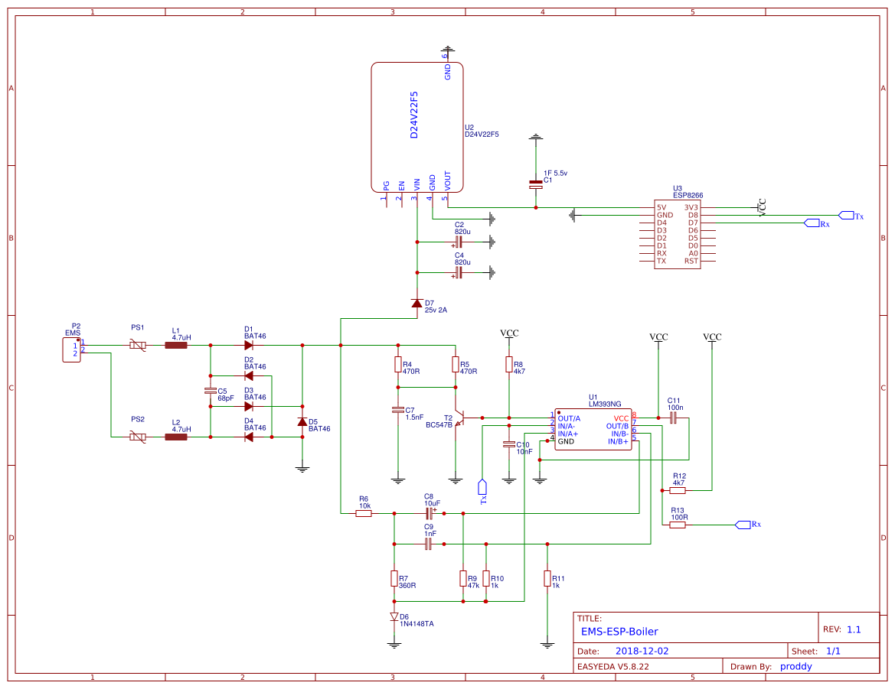
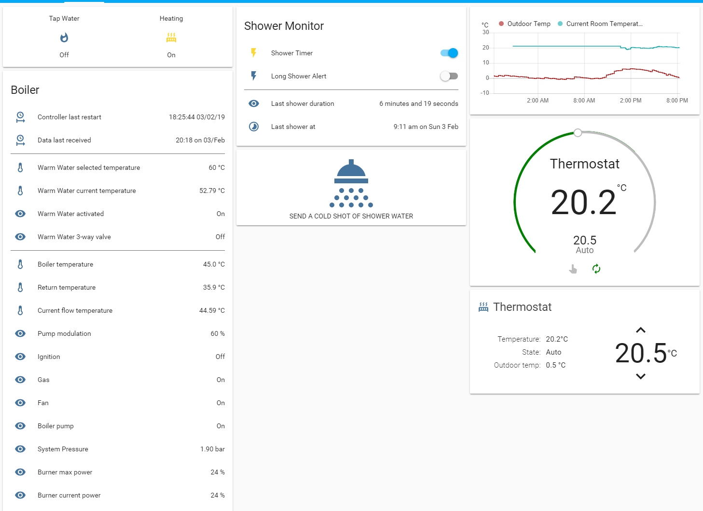

# EMS-ESP

EMS-ESP is a project to build an electronic controller circuit using an Espressif ESP8266 microcontroller to communicate with EMS (Energy Management System) based Boilers and Thermostats from the Bosch range and compatibles such as Buderus, Nefit, Junkers etc.

There are 3 parts to this project, first the design of the circuit, secondly the code for the ESP8266 microcontroller firmware with telnet and MQTT support, and lastly an example configuration for Home Assistant to monitor the data and issue direct commands via a MQTT broker.

[](https://app.codacy.com/app/proddy/EMS-ESP?utm_source=github.com&utm_medium=referral&utm_content=proddy/EMS-ESP&utm_campaign=Badge_Grade_Settings)
[](CHANGELOG.md)

- [EMS-ESP](#ems-esp)
  - [Introduction](#introduction)
  - [Supported EMS Devices](#supported-ems-devices)
  - [Supported ESP8266 devices](#supported-esp8266-devices)
  - [Getting Started](#getting-started)
  - [Monitoring The Output](#monitoring-the-output)
  - [Building The Circuit](#building-the-circuit)
    - [Powering The EMS Circuit](#powering-the-ems-circuit)
  - [Adding external temperature sensors](#adding-external-temperature-sensors)
  - [How The EMS Bus Works](#how-the-ems-bus-works)
    - [EMS IDs](#ems-ids)
    - [EMS Polling](#ems-polling)
    - [EMS Broadcasting](#ems-broadcasting)
    - [EMS Reading and Writing](#ems-reading-and-writing)
  - [The ESP8266 Source Code](#the-esp8266-source-code)
    - [Special EMS Types](#special-ems-types)
    - [Which thermostats are supported?](#which-thermostats-are-supported)
    - [Customizing The Code](#customizing-the-code)
    - [Using MQTT](#using-mqtt)
    - [The Basic Shower Logic](#the-basic-shower-logic)
  - [Home Assistant Configuration](#home-assistant-configuration)
  - [Building The Firmware](#building-the-firmware)
    - [Using PlatformIO Standalone](#using-platformio-standalone)
  - [Using the Pre-built Firmware](#using-the-pre-built-firmware)
  - [Troubleshooting](#troubleshooting)
  - [Known Issues](#known-issues)
  - [Wish List](#wish-list)
  - [Your Comments and Feedback](#your-comments-and-feedback)
  - [DISCLAIMER](#disclaimer)

## Introduction

The original intention for this home project was to build a custom smart thermostat that interfaces with my Nefit Trendline HRC30 boiler and have it controlled via a mobile app using MQTT. I had a few cheap ESP32s and ESP8266s microcontrollers lying around from previous IoT projects and learning how to build a circuit to decode the EMS bus messages seemed like a nice challenge.

Acknowledgments and kudos to the following people who have open-sourced their projects:

 **susisstrolch** - One of the first working versions of the EMS bridge circuit I found designed for specifically for the ESP8266. I borrowed Juergen's [schematic](https://github.com/susisstrolch/EMS-ESP12) and parts of his code ideas for reading telegrams.

 **bbqkees** - Kees built a working [circuit](https://shop.hotgoodies.nl/ems/) and his SMD board is available for purchase on his website.

 **EMS Wiki** - A comprehensive [reference](https://emswiki.thefischer.net/doku.php?id=wiki:ems:telegramme) (in German) for the EMS bus which is a little outdated, not always 100% accurate and sadly no longer maintained.

## Supported EMS Devices

Most Bosch branded boilers that support the Logamatic EMS bus protocols work with this design. This includes Nefit, Buderus, Worcester and Junkers (all copyrighted). Please make sure you read the **Disclaimer** carefully before sending ambiguous messages to your EMS bus as you could cause serious damage to your equipment.

Note support for the later EMS Plus (EMS+ or EMS2) standard hasn't been added yet to the library. If you'd like to help please reach out.

## Supported ESP8266 devices

The code and circuit has been tested with a few ESP8266 development boards such as the Wemos D1 Mini, Wemos D1 Mini Pro, Nodemcu0.9 and Nodemcu2 dev boards. It will also work on bare ESP8266 chips such as the ESP-12E but do make sure you disabled the LED support and wire the UART correctly as the code doesn't use the normal Rx and Tx pins.

## Getting Started

1. Either build the circuit described below or purchase a ready built board from bbqkees.
2. Grab any ESP8266 dev board. The latest bbqkees boards have a Wemos D1 pre-mounted with a copy of this firmware.
3. Optionally add external Dallas temperature sensors (to D1) and an external LED (to D5).
4. Decide whether to compile and upload the code yourself using PlatformIO or just upload the pre-baked firmware using the esptool (read these [instructions](#using-the-pre-built-firmware)). If you want to build yourself now is the time to customize your settings in `my_custom.h`. Upload the firmware via USB.
5. Connect an external USB 5v power adapter to the ESP8266 board.
7. When the ESP8266 starts up for the first time the onboard LED will be flashing. This is because the EMS bus is not yet connected and receiving data.
8. If you haven't hardcoded the WiFi credentials in step 4, the ESP8266 will boot up in a WiFi Access Point (AP) mode with the ssid name `ems-esp`. Now you can either use a laptop and connect to this AP using Telnet to `192.168.1.4` or if its powered from a computers USB use a Serial monitor tool to the ESP's COM port. Tip: to enable Telnet on Windows 10 run `dism /online /Enable-Feature /FeatureName:TelnetClient` or install something like [putty](https://www.chiark.greenend.org.uk/~sgtatham/putty/latest.html).
9. Next is to customize some of the onboard settings. Type `set` to list the current stored settings and `?` to see the syntax. Use `set wifi_ssid` and `set wifi_password` to add your WiFi credentials and if you're using MQTT set the host, username and password. There is no need to reboot the ESP.
10. The `led_gpio` will default to the onboard LED (which is probably blinking now). Ignore `thermostat_type` and `boiler_type` as these will be auto-detected hopefully later on.
11. **Important**: By default the serial port is enabled and the EMS bus disabled. This is to allow users to configure their ESP via the serial monitor when pluged into a PC/laptop. You must disable serial with `set serial off` to get the EMS transmission working.
12. Hook up the ESP to the EMS board as follows:
    
| EMS board | ESP8266 dev board |
| ----------|------------------ |
| Ground/G/J2|  GND/G |
| Rx/J2 | D7 |
| Tx/J2 | D8 |
| VC/J2 | 3v3 |
13.  Connect the EMS lines to the ESP. This can be done via the two EMS wires or via the 3.5mm service jack if you have an bbqkees board.
14.  Reboot the ESP, either by the reset switch or pulling the power.
15.  The ESP will first perform an autodetect to try and discover the EMS devices attached. If your boiler and thermostat are recognized it will set these types and store them for ever and ever. You can trace the output by telnet'ing to the board `telnet ems-esp.local`. Also use `info` to check the status.
16.  If your boiler/thermostat is not discovered create a GitHub issue stating the type and Product ID. These will be added to the file `ems_devices.h` in a future release.
17.  If all is well and there is traffic on the EMS bus the onboard LED will stop blinking and be permanently on. If this is annoying you can disable with `set led off`. To see the EMS messages type `set log v` for verbose logging.
18.  And all is not well, check the wiring, make sure serial is off and look at the telnet session for errors. If in doubt, wipe the ESP with `pio run -t erase` and start again with step #3

## Monitoring The Output

Use the telnet client to inform you of all activity and errors real-time. This is an example of the telnet output:



Type 'log v' and Enter and you'll be seeing verbose logging messages. ANSI colors with white text for info messages, green are for broadcast telegrams, yellow are the ones sent to us and red are for unknown data or telegrans which have failed the CRC check.



To see the current stats and collected values type 'info'. Watch out for unsuccessful telegram packets in the #CrcErrors line.



**Disclaimer: be careful when sending values to the boiler. If in doubt you can always reset the boiler to its original factory settings by following the instructions in the user guide. For example on my Nefit Trendline that is done by holding down the Home and Menu buttons simultaneously for a few seconds, selecting factory settings from the scroll menu followed by pressing the Reset button.**

## Building The Circuit

Included is a prototype boards you can build yourself on a breadboard.

The breadboard layout was done using [DIY Layout Creator](https://github.com/bancika/diy-layout-creator) and sources files are included in this repo.



The schematic used:



*Optionally I've also added 2 0.5A/72V polyfuses between the EMS and the two inductors L1 and L2 for extra protection.*

And here's a version using an early prototype board from **bbqkees**:



### Powering The EMS Circuit

The EMS circuit will work with both 3.3V and 5V. It's easiest though to power directly from the ESP8266's 3V3 line and run a steady 5V into the microcontroller. Powering the ESP8266 microcontroller can be either:

- via the USB if your dev board has one
- using an external 5V power supply into the 5V vin on the board
- powering from the 3.5mm service jack (stereo jack) on the boiler. This will give you 8V so you need a buck converter (like a [Pololu D24C22F5](https://www.pololu.com/product/2858)) to step this down to 5V to provide enough power to the ESP8266 (250mA at least)
- powering direct from the EMS line, which is 15V DC and using a buck converter as described above.

| With Power Circuit                              |
| ------------------------------------------ |
|  |

## Adding external temperature sensors

The code supports auto-detection of Dallas type temperature sensors. The default gpio pin used on the ESP8266 is D5 but this can be configured in the setting menu (`set dallas_gpio`). The dallas chips DS1822, DS18S20, DS18B20, DS1825 are supported including their parasite varieties.

## How The EMS Bus Works

Packages are streamed to the EMS "bus" from any other compatible connected device via serial TTL transmission using protocol 9600 baud, 8N1 (8 bytes, no parity, 1 stop bit). Each package is terminated with a break signal `<BRK>`, a 11-bit long low signal of zeros.

A package can be a single byte (see Polling below) or a string of 6 or more bytes making up an actual data telegram. A telegram is always in the format:

``[src] [dest] [type] [offset] [data] [crc] <BRK>``

The first 4 bytes is referenced as the *header* in this document.

### EMS IDs

Each device has a unique ID.

In this example a UBA boiler has an ID of 0x08 (such as a MC10) and also referred to as the Bus Master.

The circuit acts as a service key and thus uses an ID 0x0B. This ID is reserved for special devices intended for service engineers.

### EMS Polling

The bus master (boiler) sends out a poll request every second by sending out a sequential list of all possible IDs as a single byte followed by the break signal. The ID always has its high 8th bit (MSB) set so in the code we're looking for 1 byte messages matching the format `[dest|0x80] <BRK>`.

Any connected device can respond to a Polling request with an acknowledgement by sending back a single byte with its own ID. In our case we would listen for a `[0x8B] <BRK>` (meaning us) and then send back `[0x0B] <BRK>` to say we're alive and ready.

Polling is also the trigger to start transmitting any packages queued for sending. It must be done within 200ms or the bus master will time out.

### EMS Broadcasting

When a device is broadcasting to everyone there is no specific destination needed. `[dest]` is always 0x00.

The tables below shows which types are broadcasted regularly by the boiler (in this case ID 0x08) and thermostat (ID 0x17). The **data length** is excluding the 4 byte header and CRC and the **Name** references those in the German [ems wiki](https://emswiki.thefischer.net/doku.php?id=wiki:ems:telegramme).

| Source (ID)   | Type ID | Name                | Description                            | Data length | Frequency  |
| ------------- | ------- | ------------------- | -------------------------------------- | ----------- | ---------- |
| Boiler (0x08) | 0x34    | UBAMonitorWWMessage | warm water temperature                 | 19 bytes    | 10 seconds |
| Boiler (0x08) | 0x18    | UBAMonitorFast      | boiler temps, power, gas/pump switches | 25 bytes    | 10 seconds |
| Boiler (0x08) | 0x19    | UBAMonitorSlow      | boiler temp and timings                | 22 bytes    | 60 seconds |
| Boiler (0x08) | 0x1C    | UBAWartungsmelding  | maintenance messages                   | 27 bytes    | 60 seconds |
| Boiler (0x08) | 0x2A    | n/a                 | status, specific to boiler type        | 21 bytes    | 10 seconds |
| Boiler (0x08) | 0x07    | n/a                 | ?                                      | 21 bytes    | 30 seconds |

| Source (ID)       | Type ID | Name              | Description                                         | Frequency  |
| ----------------- | ------- | ----------------- | --------------------------------------------------- | ---------- |
| Thermostat (0x17) | 0x06    | RCTime            | returns time and date on the thermostat             | 60 seconds |
| Thermostat (0x17) | 0x91    | RC30StatusMessage | returns current and set temperatures                | 60 seconds |
| Thermostat (0x17) | 0xA3    | RCTempMessage     | returns temp values from external (outdoor) sensors | 60 seconds |

Refer to the code in `ems.cpp` for further explanation on how to parse these message types and also reference the EMS Wiki.

### EMS Reading and Writing

Telegrams can only be sent after the Master (boiler) sends a poll to the receiving device. The response can be a read command to request data or a write command to send data. At the end of the transmission a poll response is sent from the client (`<ID> <BRK>`) to say we're all done and free up the bus for other clients.

When executing a request to read data the `[src]` is our device `(0x0B)` and the `[dest]` must have has it's MSB (8th bit) set. Say we were requesting data from the thermostat we would use `[dest] = 0x97` since RC20 has an ID of 0x17.

Following a write request, the `[dest]` doesn't have the 8th bit set and after this write request the destination device will send either a single byte 0x01 for success or 0x04 for failure.

Every telegram sent is echo'd back to Rx, along the same Bus used for all Rx/Tx transmissions.

## The ESP8266 Source Code

`emsuart.cpp` handles the low level UART read and write logic to the bus. You shouldn't need to touch this. All receive commands from the EMS bus are handled asynchronously using a circular buffer via an interrupt. A separate function processes the buffer and extracts the telegrams.

`ems.cpp` is the logic to read the EMS data packets (telegrams), validates them and process them based on the type.

`ems-esp.cpp` is the Arduino code for the ESP8266 that kicks it all off. This is where we have specific logic such as the code to monitor and alert on the Shower timer and light up the LEDs.

`my_config.h` has all the custom settings tailored to your environment. Specific values here are also stored in the ESP's SPIFFs (File system).

`ems_devices.h` has all the configuration for the known EMS devices currently supported.

`MyESP.cpp` is my custom library to handle WiFi, MQTT and Telnet. Uses a modified version of [TelnetSpy](https://github.com/yasheena/telnetspy).

`ds18.*` are the Dallas libraries for any external temperature sensors.

### Special EMS Types

`ems.cpp` defines callback functions that handle all the broadcast types listed above (e.g. 0x34, 0x18, 0x19 etc) plus these extra types:

| Source (ID)   | Type ID | Name                          | Description                              |
| ------------- | ------- | ----------------------------- | ---------------------------------------- |
| Boiler (0x08) | 0x33    | UBAParameterWW                | reads selected & desired warm water temp |
| Boiler (0x08) | 0x14    | UBATotalUptimeMessage         |                                          |
| Boiler (0x08) | 0x15    | UBAMaintenanceSettingsMessage |                                          |
| Boiler (0x08) | 0x16    | UBAParametersMessage          |                                          |

In `ems.cpp` you can add scheduled calls to specific EMS types in the functions         `ems_getThermostatValues()` and `ems_getBoilerValues()`.

### Which thermostats are supported?

I am still working on adding more support to known thermostats. Any contributions here are welcome. The know types are listed in `ems_devices.h` and include

- RC10, RC20 and RC30 are fully supported
- RC35 with support for the 1st heating circuit (HC1)
- TC100/TC200/Easy but only with support for *reading* the temperature values. There seems to be no way to set settings using EMS bus messages that I know of. One option is to send XMPP messages but a special server is needed and out of scope for this project.

### Customizing The Code

- To configure for your thermostat and specific boiler settings, modify `my_config.h`.
- Most values can also be set from the telnet command menu using the **set** command.
- To add new handlers for EMS data types, first create a callback function and add to the `EMS_Types` array at the top of the file `ems.cpp` and modify `ems.h`. Also add to `ems_devices.h`.

### Using MQTT

The boiler data is collected and sent as a single JSON object to MQTT TOPIC `home/ems-esp/boiler_data`. The `home` preifx is the MQTT topic prefix and can be customized in `my_config.h`. A hash is generated (CRC32 based) to determine if the payload has changed, otherwise it will not be sent. An example payload looks like:

`{"wWSelTemp":"60","selFlowTemp":"5.0","outdoorTemp":"?","wWActivated":"on","wWComfort":"Comfort","wWCurTmp":"46.0","wWCurFlow":"0.0","wWHeat":"on","curFlowTemp":"54.2","retTemp":"51.5","burnGas":"off","heatPmp":"off","fanWork":"off","ignWork":"off","wWCirc":"off","selBurnPow":"0","curBurnPow":"0","sysPress":"1.2","boilTemp":"56.7","pumpMod":"0","ServiceCode":"0H"}`

Similarly the thermostat values are also sent as a JSON package with the topic `home/ems-esp/thermostat_data` along with the current mode, room temperature and set temperature:

`{"thermostat_currtemp":"19.8","thermostat_seltemp":"16.0","thermostat_mode":"manual"}`

These incoming MQTT topics are also handled:

| topic               | ID in my_config.h         | Payload                | Description                              |
| ------------------- | ------------------------- | ---------------------- | ---------------------------------------- |
| thermostat_cmd_temp | TOPIC_THERMOSTAT_CMD_TEMP | temperature as a float | sets the thermostat current setpoint     |
| thermostat_cmd_mode | TOPIC_THERMOSTAT_CMD_MODE | auto, day, night       | sets the thermostat mode                 |
| wwactivated         | TOPIC_BOILER_WWACTIVATED  | 0 or 1                 | turns boiler warm water on/off (not tap) |
| boiler_cmd_wwtemp   | TOPIC_BOILER_CMD_WWTEMP   | temperature as a float | sets the boiler wwtemp current setpoint  |

If MQTT is not used use 'set mqtt_host' to remove it.

Some home automation systems such as Domoticz and OpenHab have special formats for their MQTT messages so I would advise to use [node-red](https://nodered.org/) as a parser like in [this example](https://www.domoticz.com/forum/download/file.php?id=18977&sid=67d048f1b4c8833822175eac6b55ecff).

### The Basic Shower Logic

Checking whether the shower is running is tricky. We know when the warm water is on and being heated but need to distinguish between the central heating, shower, hot tap and even a bath tap. So this code is a little experimental.

There is other logic in the code to compensate for water heating up to shower temperature and whether the shower is turned off and back on again quickly within a 10 second window.

## Home Assistant Configuration

Within Home Assistant it renders as:



and the alerts on an iOS/Android device using PushBullet, PushOver or any notification service would look like:


You can find the .yaml configuration files under `doc/ha`. See also this [HA forum post](https://community.home-assistant.io/t/thermostat-and-boiler-controller-for-ems-based-boilers-nefit-buderus-bosch-using-esp/53382).

## Building The Firmware

### Using PlatformIO Standalone

**On Windows:**

- Download [Git](https://git-scm.com/download/win) (install using the default settings)
- Download and install [Visual Studio Code](https://code.visualstudio.com/docs/?dv=win) (VSC). It's like 40MB so don't confuse with the commercial Microsoft Visual Studio.
- Restart the PC (if using Windows) to apply the new PATH settings. It should now detect Git
- Install the VSC extension "PlatformIO IDE" then click reload to activate it
- Git clone this repo, eith using `git clone` from PlatformIO's terminal or the Git GUI interface
- Create a `platformio.ini` based on the `platformio.ini-example` making the necessary changes for your board type

**On Linux (e.g. Ubuntu under Windows 10):**

Make sure Python 2.7 is installed, then...
```python
% pip install -U platformio
% sudo platformio upgrade
% platformio platform update
% platformio lib upgrade

% git clone https://github.com/proddy/EMS-ESP.git
% cd EMS-ESP
% cp platformio.ini-example platformio.ini
```
edit `platformio.ini` to set `env_default` to your board type, then
```c
% platformio run -t upload
```

## Using the Pre-built Firmware

pre-baked firmware for the Wemos D1 mini is available in the GitHub [releases](https://github.com/proddy/EMS-ESP/releases) which you can upload yourself using the [esptool](https://github.com/espressif/esptool) bootloader like `esptool.py -p <com port> write_flash 0x00000 <firmware.bin file>`. Here's how to set it up on Windows:

1. Check if you have **python 2.7** installed. If not [download it](https://www.python.org/downloads/) and make sure you select the option to add Python to the windows PATH
2. Then install the ESPTool by running `pip install esptool` from a command prompt

The ESP8266 will start in Access Point (AP) mode. Connect via WiFi to the SSID **EMS-ESP** and telnet to **192.168.4.1**. Then use the `set wifi_ssid/set wifi_password` command to configure your own network settings. Alternatively connect the ESP8266 to your PC and open a Serial monitor (with baud 115200) to configure the settings. Make sure you disable Serial support before connecting the EMS lines using `set serial off`.

`set` wil list all currently stored settings.

`set erase` will clear all settings.

## Troubleshooting

When flashing for the first time the Serial port is enabled by default with baud 115200. You can then use a PC with USB to the ESP8266 to set the settings like wifi, mqtt etc and also monitor the boot up procedure. Remember to disable the serial (`set serial off`) when connecting to the EMS lines.

The onboard LED will flash if there is no connection with the EMS bus. You can disable LED support by the 'set led' command from the telnet client.

If you want to completely erase the ESP and rebuild the firmware then do a `pio run -t erase` which will wipe the onboard flash including the SPIFFs where all the settings are stored.

## Known Issues

Some annoying issues that need fixing:

- On newer EMS+ Boilers the Tx commands for reading and writing may not always work. I believe there is some handshake that needs to happen before the UBA3/Master is able to send a poll request to our service device.

## Wish List

- Measure amount of gas in m3 per day for the hot water vs the central heating, and convert this into cost.
- Support changing temperatures on an Nefit Easy. To do this we must send XMPP messages directly to the thermostat. There is already a TCP stack and a Wifi and Telnet server running in the code, so the building blocks are there to extend with another XMPP client. Here are a number of Python based projects that show how to do this:
  - https://github.com/patvdleer/nefit-client-python
  - https://github.com/marconfus/ha-nefit
  - https://github.com/robertklep/nefit-easy-core
- Improve detection of Heating Off without checking for selFlowTemp (selected flow temperature)
- Split MQTT into smaller chunks. Now the messages can be up to 600 bytes which may cause issues. Preferably make the items configurable.

## Your Comments and Feedback

Any comments, suggestions or code contributions are very welcome. Please post a GitHub issue.

## DISCLAIMER

This code and libraries were developed from information gathered on the internet and many hours of reverse engineering the communications between the EMS bus and thermostats. It is **not** based on any official documentation or supported libraries from Buderus/Junkers/Nefit (and associated companies) and therefore there are no guarantees whatsoever regarding the safety of your devices and/or their settings, or the accuracy of the information provided.
