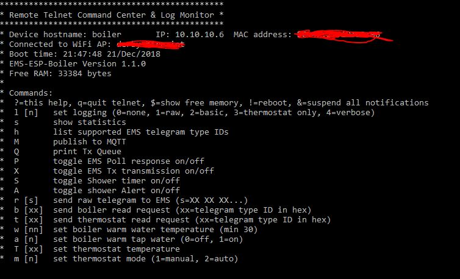
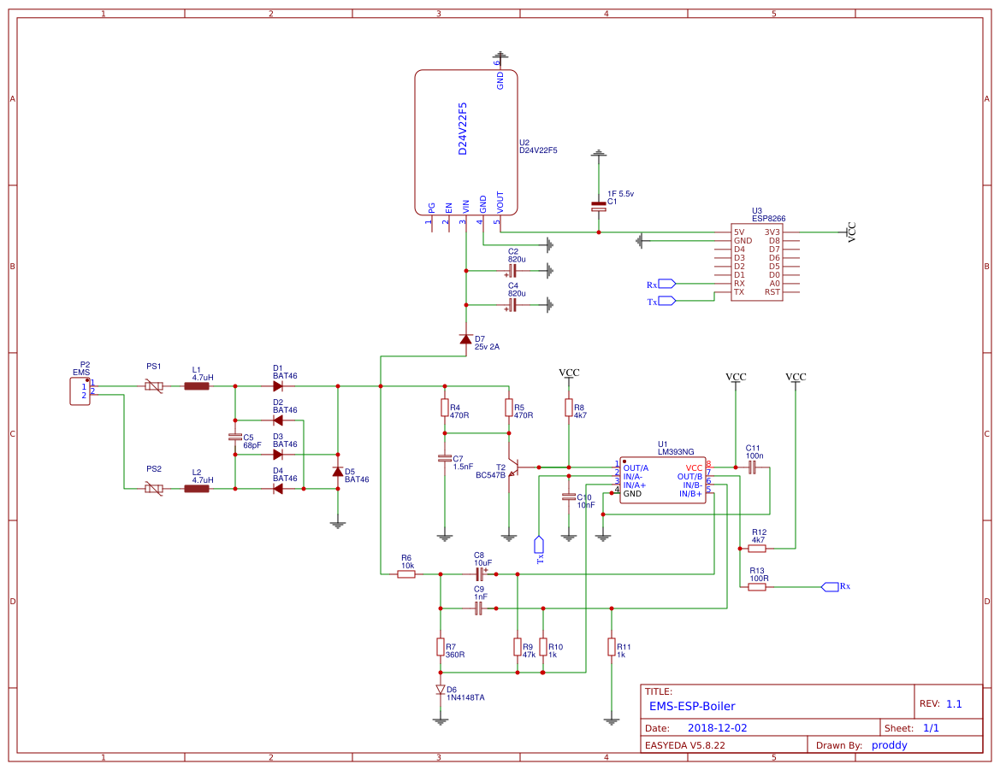
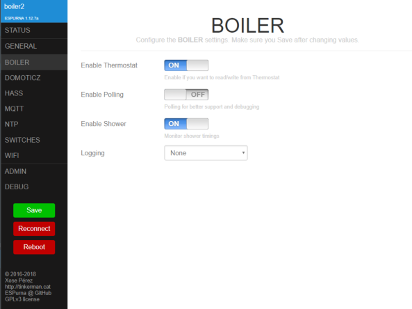

# EMS-ESP-Boiler

EMS-ESP-Boiler is a project to build a controller circuit running with an ESP8266 to communicate with EMS (Energy Management System) based Boilers and Thermostats from the Bosch range and compatibles such as Buderus, Nefit, Junkers etc.

There are 3 parts to this project, first the design of the circuit, second the code for the ESP8266 microcontroller firmware and lastly an example configuration for Home Assistant to monitor the data and issue direct commands via MQTT.

[](CHANGELOG.md)
[](https://github.org/xoseperez/espurna/tree/dev/)
[](LICENSE)

- [EMS-ESP-Boiler](#ems-esp-boiler)
  - [Introduction](#introduction)
  - [Supported Boilers Types](#supported-boilers-types)
  - [Supported ESP8266 devices](#supported-esp8266-devices)
  - [Getting Started](#getting-started)
  - [Monitoring The Output](#monitoring-the-output)
  - [Building The Circuit](#building-the-circuit)
    - [Powering The EMS Circuit](#powering-the-ems-circuit)
  - [How The EMS Bus Works](#how-the-ems-bus-works)
    - [EMS IDs](#ems-ids)
    - [EMS Polling](#ems-polling)
    - [EMS Broadcasting](#ems-broadcasting)
    - [EMS Reading and Writing](#ems-reading-and-writing)
  - [The ESP8266 Source Code](#the-esp8266-source-code)
    - [Supported EMS Types](#supported-ems-types)
    - [Supported Thermostats](#supported-thermostats)
      - [RC20 (Moduline 300)](#rc20-moduline-300)
      - [RC30 (Moduline 400)](#rc30-moduline-400)
      - [RC35](#rc35)
      - [TC100/TC200 (Nefit Easy)](#tc100tc200-nefit-easy)
    - [Customizing The Code](#customizing-the-code)
    - [Using MQTT](#using-mqtt)
    - [The Basic Shower Logic](#the-basic-shower-logic)
  - [Home Assistant Configuration](#home-assistant-configuration)
  - [Building The Firmware](#building-the-firmware)
    - [Using PlatformIO Standalone](#using-platformio-standalone)
    - [Using ESPurna](#using-espurna)
    - [Using Pre-built Firmware](#using-pre-built-firmware)
    - [Building Using Arduino IDE](#building-using-arduino-ide)
  - [Known Issues](#known-issues)
  - [Wish List](#wish-list)
  - [Your Comments and Feedback](#your-comments-and-feedback)
  - [DISCLAIMER](#disclaimer)

## Introduction

My original intention for this home project with to build my own smart thermostat for my Nefit Trendline boiler and then have it controlled automatically via [Home Assistant](https://www.home-assistant.io/) on my mobile phone. I had a few ESP32s and ESP8266s lying around from previous IoT projects and building a specific circuit to decode the EMS messages was a nice challenge into designing complete end-to-end complex electronic circuits. I then began adding new features such as timing how long the shower would be running for and subsequently triggering an alarm (actually a shot of cold water) after a certain period.

Acknowledgments and kudos to the following people and their open-sourced projects that have helped me get this far:

 **susisstrolch** - Probably the first working version of the EMS bridge circuit I found designed for the ESP8266. I borrowed Juergen's [schematic](https://github.com/susisstrolch/EMS-ESP12) and parts of his code logic.

 **bbqkees** - Kees built a [circuit](https://github.com/bbqkees/Nefit-Buderus-EMS-bus-Arduino-Domoticz) and some sample Arduino code to read from the EMS and push messages to Domoticz. His SMD board is also now available for purchase.

 **EMS Wiki** - A comprehensive [reference](https://emswiki.thefischer.net/doku.php?id=wiki:ems:telegramme) for decoding the EMS telegrams, which I found not always to be 100% accurate. It's in German so use Google Translate if you need help.

## Supported Boilers Types

Most Bosch branded boilers that support the Logamatic EMS (and EMS+) bus protocols work with this design. Which are Nefit, Buderus, Worcester and Junkers and copyrighted. Please make sure you read the **Disclaimer** carefully before sending ambigious messages to your EMS bus as you cause device damage.

## Supported ESP8266 devices

I've tested the code and circuit with a few ESP8266 development boards such as the Wemos D1 Mini, Wemos D1 Mini Pro, Nodemcu0.9 and Nodemcu2 boards. It will also work on bare ESP8266 chips such as the E-12s but do make sure you disabled the LED support and wire the UART correctly as the code doesn't use the normal Rx and Tx pins. This is explained below.

## Getting Started

1. Either build the circuit below or purchase a ready built board from bbqkees via his [GitHub](https://github.com/bbqkees/Nefit-Buderus-EMS-bus-Arduino-Domoticz) page or the [Domoticz forum](http://www.domoticz.com/forum/viewtopic.php?f=22&t=22079&start=20).
2. Get an ESP8266 dev board and connect the 2 EMS output lines from the boiler to the circuit and the Rx and Tx out to ESP pins D7 and D8 respectively. The EMS connection can either be the 12-15V AC direct from the thermostat bus line or from the 3.5" Service Jack at the front.
3. Optionally connect the three LEDs to show Rx and Tx traffic and Error codes to pins D1, D2, D3 respectively. I use 220 Ohm pull-down resistors. These pins are configurable in ``boiler.ino``. This is further explained in the **code** section below.
4. Build and upload the firmware to the ESP8266 device. I used Platformio with Visual Studio. Do make sure you set the MQTT and WiFi credentials correctly and if you're not using MQTT leave the MQTT_IP blank. The firmware supports OTA too with the default hostname as 'boiler' (or 'boiler.' depending on your OS and how the mdns resolves hostnames).
5. Power the ESP either via USB or direct into the 5v vin pin from an external power 5V volts supply with min 400mA.
6. Attach the 3v3 out on the ESP8266 to the DC power line on the EMS circuit as indicated in the schematics.
7. The WiFi connects via DHCP by default. Find the IP by from your router and then telnet (port 23) to it. Tip: to enable Telnet on Windows run `dism /online /Enable-Feature /FeatureName:TelnetClient` or install something like [putty](https://www.chiark.greenend.org.uk/~sgtatham/putty/latest.html). If everything is working you should see the messages appear in the window as shown in the next section. However if you're unable to locate the IP of the ESP then probably the WiFi failed to instantiate. In this case add -DUSE_SERIAL to the build options, connect at USB, build, upload and then use a terminal to connect to the serial port to see the debug messages. A word of warning, do not use both a USB and power from the EMS at the same time.

## Monitoring The Output

Use the telnet client to inform you of all activity and errors real-time. This is an example of the telnet output:



If you type 'l 4' and Enter, it will toggle verbose logging showing you more detailed messages. I use ANSI colors with white text for info messages, green for well formatted telegram packages (which have validated CRC checks), red for corrupt packages and yellow for send responses.


To see the current values of the Boiler and its parameters type 's' and hit Enter. Watch out for unsuccessful telegram packets in the #CrcErrors line.


Commands can be issued directly to the EMS bus typing in a letter followed by an optional parameter and pressing Enter. Supported commands are:

- **b** to send a read command to the boiler. The 2nd parameter is the type. For example 'b 33' will request type UBAParameterWW and bring back the Warm Water temperatures from the Boiler.
- **t** is similar, but to send a read command to the thermostat.
- **T** set the thermostat temperature to the given celsius value
- **w** to adjust the temperature of the warm water from the boiler
- **a** to turn the warm tap water on and off
- **h** to list all the recognized EMS types
- **P** to toggle the Polling response on/off (note it's not necessary to have Polling enabled to work)
- **m** to set the thermostat mode to manual or auto
- **S** to toggle the Shower Timer functionality on/off
- **A** to toggle the Shower Timer Alert functionality on/off

**Disclaimer: be careful when sending values to the boiler. If in doubt you can always reset the boiler to its original factory settings by following the instructions in the user guide. On my **Nefit Trendline HRC30** that is done by holding down the Home and Menu buttons simultaneously for a few seconds, selecting factory settings from the scroll menu and lastly pressing the Reset button.**

## Building The Circuit

The EMS circuit is really all credit to the hard work many people have done before me, noticeably *susisstrolch* with his ESP8266 [version](https://github.com/susisstrolch/EMS-ESP8266_12-PCB/tree/newmaster/Schematics/EMS-ESP8266-12).

I've included a prototype boards you can build yourself on a breadboard. One part for only reading values from the Boiler and an extension with the write logic so you can also send commands.

We need the Rx/Tx of the ESP8266 for flashing, so the code in ``emsuart.cpp`` switches the UART pins to use RX1 and TX1 (GPIO13/D7 and GPIO15/D8 respectively). This also prevents any bogus stack data being sent to EMS bus when the ESP8266 decides to crash like after a Watch Dog Reset.

The breadboard layout was done using [DIY Layout Creator](https://github.com/bancika/diy-layout-creator) and sources files are included in this repo.


The schematic used (as designed by [susisstrolch](https://github.com/susisstrolch/EMS-ESP8266_12-PCB)):


*Optionally I've also added 2 0.5A/72V polyfuses between the EMS and the two inductors L1 and L2 for extra protection.*

And lastly if you don't fancy building the circuit, [bbqkees](http://www.domoticz.com/forum/memberlist.php?mode=viewprofile&u=1736) can sell you one complete with SMD components which looks like the photo below when connected to a Wemos D1 Mini:


### Powering The EMS Circuit

The EMS circuit will work with both 3.3V and 5V. It's easiest though to power directly from the ESP8266's 3V3 line and run a steady 5V into the microcontroller. Powering the ESP8266 microcontroller can be either:

- via the USB if your dev board has one
- using an external 5V power supply into the 5V vin on the board
- powering from the 3.5" service jack on the boiler. This will give you 8V so you need a buck converter (like a [Pololu D24C22F5](https://www.pololu.com/product/2858)) to step this down to 5V to provide enough power to the ESP8266 (250mA at least)
- powering from the EMS line, which is 15V A/C and using a buck converter as described above. Note the current design has stability issues when sending packages in this configuration so this is not recommended yet if you plan to many send commands to the thermostat or boiler.

| With Power Circuit                              |
| ------------------------------------------ |
|  |

## How The EMS Bus Works

Packages are sent to the EMS "bus" from the Boiler and any other compatible connected devices via serial TTL transmission. The protocol is 9600 baud, 8N1 (8 bytes, no parity, 1 stop bit). Each package is terminated with a break signal `<BRK>`, a 11-bit long low signal of zeros.

A package can be a single byte (see Polling below) or a string of 6 or more bytes making up an actual data telegram. A telegram is always in the format:

``[src] [dest] [type] [offset] [data] [crc] <BRK>``

I reference the first 4 bytes as the *header* in this document.

### EMS IDs

Each device has a unique ID.

The Boiler has an ID of 0x08 (type MC10) and also referred to as the Bus Master or UBA.

My thermostat, which is a* Moduline 300* uses the RC30 protocol and has an ID 0x17. If you're using a RC35 type thermostat such as the newer Moduline 300s or 400s use 0x10 and make adjustments in the code as appropriate. bbqkees did a nice write-up on his github page [here](https://github.com/bbqkees/Nefit-Buderus-EMS-bus-Arduino-Domoticz/blob/master/README.md).

Our circuit acts as a service key and thus uses an ID 0x0B. This ID is reserved for special devices intended for installation engineers for maintenance work.

### EMS Polling

The bus master (boiler) sends out a poll request every second by sending out a sequential list of all possible IDs as a single byte followed by the break signal. The ID always has its high 8th bit (MSB) set so in the code we're looking for 1 byte messages matching the format `[dest|0x80] <BRK>`.

Any connected device can respond to a Polling call with an acknowledging by sending back a single byte with its own ID. In our case we would listen for a `[0x8B] <BRK>` (meaning us) and then send back `[0x0B] <BRK>` to say we're alive and ready. Although I found this is not needed for normal operation so it's disabled as default in the code.

Polling is also the trigger to start transmitting any packages queued for sending. It must be done within 200ms or the bus master will time out.

### EMS Broadcasting

When a device is broadcasting to everyone there is no specific destination needed. `[dest]` is always 0x00.

The tables below shows which types are broadcasted regularly by the boiler (ID 0x08) and thermostat (ID 0x17). The **data length** is excluding the 4 byte header and CRC and the **Name** references those in the [ems wiki](https://emswiki.thefischer.net/doku.php?id=wiki:ems:telegramme).

| Source (ID)   | Type ID | Name                | Description                            | Data length | Frequency  |
| ------------- | ------- | ------------------- | -------------------------------------- | ----------- | ---------- |
| Boiler (0x08) | 0x34    | UBAMonitorWWMessage | warm water temperature                 | 19 bytes    | 10 seconds |
| Boiler (0x08) | 0x18    | UBAMonitorFast      | boiler temps, power, gas/pump switches | 25 bytes    | 10 seconds |
| Boiler (0x08) | 0x19    | UBAMonitorSlow      | boiler temp and timings                | 22 bytes    | 60 seconds |
| Boiler (0x08) | 0x1C    | UBAWartungsmelding  | maintenance messages                   | 27 bytes    | 60 seconds |
| Boiler (0x08) | 0x2A    | n/a                 | status, specific to boiler type        | 21 bytes    | 10 seconds |
| Boiler (0x08) | 0x07    | n/a                 | ?                                      | 21 bytes    | 30 seconds |

| Source (ID)       | Type ID | Name              | Description                                         | Frequency  |
| ----------------- | ------- | ----------------- | --------------------------------------------------- | ---------- |
| Thermostat (0x17) | 0x06    | RCTime            | returns time and date on the thermostat             | 60 seconds |
| Thermostat (0x17) | 0x91    | RC30StatusMessage | returns current and set temperatures                | 60 seconds |
| Thermostat (0x17) | 0xA3    | RCTempMessage     | returns temp values from external (outdoor) sensors | 60 seconds |

Refer to the code in `ems.cpp` for further explanation on how to parse these message types and also reference the EMS Wiki.

### EMS Reading and Writing

Telegram packets can only be sent after the Boiler sends a poll to the sending device. The response can be a read command to request data or a write command to send data. At the end of the transmission a poll response is sent from the client (`<ID> <BRK>`) to say we're all done and free up the bus for other clients.

When doing a request to read data the `[src]` is our device `(0x0B)` and the `[dest]` must have has it's MSB (8th bit) set. Say we were requesting data from the thermostat we would use `[dest] = 0x97` since RC30 has an ID of 0x17.

Following a write request, the `[dest]` doesn't have the 8th bit set and after this write request the destination device will send either a single byte 0x01 for success or 0x04 for failure.

Every telegram sent is echo'd back to Rx.

## The ESP8266 Source Code

*Disclaimer*: This code here is really for reference only, I don't expect anyone to use "as is" since it's highly tailored to my environment and my needs. Most of the code however is self explanatory with comments here and there in the code.

The code is built on the Arduino framework and is dependent on these external libraries:

- Time http://playground.arduino.cc/code/time
- PubSubClient http://pubsubclient.knolleary.net
- ArduinoJson https://github.com/bblanchon/ArduinoJson
- CRC32 https://github.com/bakercp/CRC32

`emsuart.cpp` handles the low level UART read and write logic. You shouldn't need to touch this. All receive commands from the EMS bus are handled asynchronously using a circular buffer via an interrupt. A separate function processes the buffer and extracts the telegrams. Since we don't send too many write commands this is done sequentially. I couldn't use the standard Arduino Serial implementation because of the 11-bit break signal causes a frame-error which gets ignored.

`ems.cpp` is the logic to read the EMS packets (telegrams), validates them and process them based on the type.

`boiler.ino` is the Arduino code for the ESP8266 that kicks it all off. This is where we have specific logic such as the code to monitor and alert on the Shower timer and light up the LEDs. LED support is enabled by setting the -DUSE_LED build flag.

`ESPHelper.cpp` is my customized version of [ESPHelper](https://github.com/ItKindaWorks/ESPHelper) with added Telnet support and some other minor tweaking.

### Supported EMS Types

`ems.cpp` defines callback functions that handle all the broadcast types listed above (e.g. 0x34, 0x18, 0x19 etc) plus these extra types:

| Source (ID)       | Type ID          | Name                          | Description                              |
| ----------------- | ---------------- | ----------------------------- | ---------------------------------------- |
| Boiler (0x08)     | 0x33             | UBAParameterWW                | reads selected & desired warm water temp |
| Boiler (0x08)     | 0x14             | UBATotalUptimeMessage         |                                          |
| Boiler (0x08)     | 0x15             | UBAMaintenanceSettingsMessage |                                          |
| Boiler (0x08)     | 0x16             | UBAParametersMessage          |                                          |
| Thermostat (0x17) | 0xA8             | RC20Set                       | sets operating modes for an RC20         |
| Thermostat (0x10) | 0xA7             | RC30Set                       | sets operating modes for an RC30         |
| Thermostat        | 0x02             | Version                       | reads Version major/minor                |
| Thermostat        | 0x91, 0x41, 0x0A | Status Message                | read monitor values                      |

In `boiler.ino` you can make calls to automatically send these read commands. See the function *regularUpdates()*

### Supported Thermostats

Modify `EMS_ID_THERMOSTAT` in `myconfig.h` to the thermostat type you want to support. 

#### RC20 (Moduline 300)

Read and write of setpoint temp and mode supported.

#### RC30 (Moduline 400)

Read and write of setpoint temp and mode supported.

Type's 3F, 49, 53, 5D are identical. So are 4B, 55, 5F and mostly zero's. Types 40, 4A, 54 and 5E are also the same.

#### RC35

***not implemented yet***!

An RC35 thermostat can support up to 4 heating circuits each controlled with their own Monitor and Working Mode IDs.

Fetching the thermostats setpoint temp us by requesting 0x3E and looking at the 3rd byte in the data telegram (data[2]) and dividing by 2.
The mode is on type 0x47 (or 0x3D) and the 8th byte (data[7]). 0=off, 1=on, 2=auto

#### TC100/TC200 (Nefit Easy)

There is limited support for an Nefit Easy TC100/TC200 type thermostat. The current room temperature and setpoint temperature can be read. What I'm still figuring out is how to read the mode and set the temperature values without sending http post commands to their web server.

### Customizing The Code

- To configure for your thermostat and specific boiler settings, modify `my_config.h`. Here you can
  - set the thermostat type. The default ID is 0x17 for an RC30 Moduline 300.
  - set flags for enabled/disabling functionality such as `BOILER_THERMOSTAT_ENABLED`, `BOILER_SHOWER_ENABLED` and `BOILER_SHOWER_TIMER`.
  - Set WIFI and MQTT settings, instead of doing this in `platformio.ini`
- To add new handlers for EMS data types, first create a callback function and add to the `EMS_Types` array at the top of the file `ems.cpp` and modify `ems.h`

### Using MQTT

When the ESP8266 boots it will send a start signal via MQTT. This is picked up by Home Assistant and sends a notification informing me that the device has booted. Useful for knowing when the ESP gets reset.

I'm using the standard PubSubClient client so make sure you set `-DMQTT_MAX_PACKET_SIZE=400` as the default package size is 128 and our JSON messages are around 300 bytes.

I run Mosquitto on my Raspberry PI 3 as the MQTT broker.

The boiler data is collected and sent as a single JSON object to MQTT TOPIC `home/boiler/boiler_data` (or `{hostname}/boiler_data` for ESPurna). A hash is generated (CRC32 based) to determine if the payload has changed, otherwise don't send it. An example payload looks like:

`{"wWCurTmp":"43.0","wWHeat":"on","curFlowTemp":"51.7","retTemp":"48.0","burnGas":"off","heatPmp":"off","fanWork":"off","ignWork":"off","wWCirc":"off","selBurnPow":"0","curBurnPow":"0","sysPress":"1.6","boilTemp":"54.7","pumpMod":"4"}`

Similarly the thermostat values are sent as a json package under a topic named `home/boiler/thermostat_data` with the current mode, room temperature and set temperature.

These topics can be configured in the `TOPIC_*` defines in `boiler.ino`. Make sure you change the HA configuration too to match.

### The Basic Shower Logic

Checking whether the shower is running was tricky. We know when the warm water is on and being heated but need to distinguish between the central heating, shower, hot tap and bath. I found via trial and error the Selected Burner Max Power is between 80% and 115% when the shower is running and fixed at 75% if the central heating is on. Furthermore the Selected Flow Impulsion is 80 C for the heating.

There is other logic in the code to compensate for ramp up and whether the shower is turned off and back on again quickly within a 10 second window.

## Home Assistant Configuration

Within Home Assistant it renders as:


and the alerts on an iOS/Android device using PushBullet, PushOver or any notification service would look like:


You can find the .yaml configuration files under `doc/ha`. See also https://community.home-assistant.io/t/thermostat-and-boiler-controller-for-ems-based-boilers-nefit-buderus-bosch-using-esp/53382

## Building The Firmware

### Using PlatformIO Standalone

PlatformIO is my preferred way. The code uses a modified version [ESPHelper](https://github.com/ItKindaWorks/ESPHelper) which handles all the basic handling of the WiFi, MQTT, OTA and Telnet server. I switched from Atom to the marvelous Visual Studio Code, works on Windows, OSX and Linux.

**On Windows:**

- Download [Git](https://git-scm.com/download/win) (install using the default settings)
- Download and install [Visual Studio Code](https://code.visualstudio.com/docs/?dv=win) (VSC). It's like 40MB so don't confuse with the commercial Microsoft Visual Studio.
- Restart the PC (if using Windows) to apply the new PATH settings. It should now detect Git
- Install these VSC extensions: PlatformIO IDE & GitLens, and then click reload to activate them
- Git clone this repo, eith using `git clone` from PlatformIO's terminal or the Git GUI interface
- Create a `platformio.ini` based on the `platformio.ini-example` making the necessary changes for your WiFi and MQTT credentials in the build flags. If you're not using MQTT leave MQTT_IP empty (`MQTT_IP=""`)

**On Linux (e.g. Ubuntu under Windows10):**

- make sure Python 2.7 is installed
- make sure you have a Linux distro installed (https://docs.microsoft.com/en-us/windows/wsl/install-win10)
- Do:
```python
% pip install -U platformio
% sudo platformio upgrade
% platformio platform update

% git clone https://github.com/proddy/EMS-ESP-Boiler.git
% cd EMS-ESP-Boiler
% cp platformio.ini-example platformio.ini
```
- edit `platformio.ini` to set `env_default` and the flags `WIFI_SSID WIFI_PASSWORD, MQTT_IP, MQTT_USER, MQTT_PASS`. If you're not using MQTT leave MQTT_IP empty (`MQTT_IP=""`)
```c
% platformio run -t upload
```

### Using ESPurna

[ESPurna](https://github.com/xoseperez/espurna/wiki) is framework that handles most of the tedious tasks of building IoT devices so you can focus on the functionality you need. This replaces my ESPHelper code in the standalone version above. ESPurna is natively built on PlatformIO and Visual Studio Code too which is nice. The latest version I tested this on is 1.13.3. So if you're brave, follow these steps:

1. Download and install [NodeJS](https://nodejs.org/en/download). This gives you npm. Choose the LTS version
2. Download ESPurna by cloning the ESPurna git repository (command palette, git clone, https://github.com/xoseperez/espurna.git)
3. Restart VSC.
4. From VSC open the folder `espurna\code`. PlatformIO should detect and set some things up for you automagically
5. open a terminal window (*ctrl-`*)
6. Install the node modules: `npm install --only=dev`
7. Build the web interface:  `node node_modules/gulp/bin/gulp.js`. This will create a compressed `code/espurna/static/index.html.gz.h`. If you get warnings about lf during the building edit `gulpfile.js` and change the line `'failOnError': true` to `false` as a temporary workaround.
8. Modify the platformio.ini file making sure you add `-DUSE_CUSTOM_H -DUSE_EXTRA` to the `debug_flags`
9. Copy the following files from EMS-ESP-Boiler repo to where you installed ESPurna
```c
espurna/index.html -> code/html/index.html
espurna/custom.h -> code/config/custom.h
espurna/boiler-espurna.ino -> code/espurna/boiler-espurna.ino
ems*.* -> code/espurna/
```
10. Now build and upload as you usually would with PlatformIO (or ctrl-arl-t and choose the right build). Look at my version of platformio.ini as an example.
11.  When the firmware loads, use a wifi connected pc/mobile to connect to the Access Point called ESPURNA_XXXXXX. Use 'fibonacci' as the password. Navigate to `http://192.168.4.1` from a browser, set a new username and password when prompted, log off the wifi and reconnect to the AP using these new credentials. Again go to 192.168.4.1
12.  In the ADMIN page enable Telnet and SAVE
13.  In the WIFI page add your home wifi details, click SAVE and reboot, and go to the new IP
14.  Configure MQTT

The Telnet functions are `BOILER.READ`, `BOILER.INFO` and a few others for reference. `HELP` will list them. Add your own functions to expand the functionality by calling the EMS* functions as in the examples.

If you run into issues refer to ESPurna's official setup instructions [here](https://github.com/xoseperez/espurna/wiki/Build-and-update-from-Visual-Studio-Code-using-PlatformIO) and [here](https://github.com/xoseperez/espurna/wiki/Configuration).

This is what ESPurna looks like with the custom boiler code:



*Note: I didn't bother porting all the EMS Read and Write commands from the Telnet code to the Espurna, but its pretty straight forward if you want to extend the code.*

### Using Pre-built Firmware

pre-baked firmwares for some ESP8266 devices based on ESPurna are available in the directory `/firmware` which you can upload yourself using [esptool](https://github.com/espressif/esptool) bootloader. On Windows, follow these instructions:

1. Check if you have **python 2.7** installed. If not [download it](https://www.python.org/downloads/) and make sure you select the option to add Python to the windows PATH
2. Install the ESPTool by running `pip install esptool` from a command prompt
3. Connect the ESP via USB, figure out the COM port
4. run `esptool.py -p <com> write_flash 0x00000 <firmware>` where firmware is the `.bin` file and \<com\> is the COM port, e.g. `COM3`

now follow the steps in ESPurna section above from #10 on to configure the device.

### Building Using Arduino IDE

Porting to the Arduino IDE can be a little tricky but it is possible.

- Add the ESP8266 boards (from Preferences add Additional Board URL `http://arduino.esp8266.com/stable/package_esp8266com_index.json`)
- Go to Boards Manager and install ESP8266 2.4.x platform
- Select your ESP8266 from Tools->Boards and the correct port with Tools->Port
- From the Library Manager install ArduinoJson 5.13.x, PubSubClient 2.6.x, CRC32 and Time
- The Arduino IDE doesn't have a common way to set build flags (ugh!) so you'll need to un-comment these lines in `boiler.ino`:

```c
#define WIFI_SSID "<my_ssid>"
#define WIFI_PASSWORD "<my_password>"
#define MQTT_IP "<broker_ip>"
#define MQTT_USER "<broker_username>"
#define MQTT_PASS "<broker_password>"
```

- Put all the files in a single sketch folder (`ESPHelper.*, boiler.ino, ems.*, emsuart.*`)
- cross your fingers and hit CTRL-R to compile...

## Known Issues

Some annoying issues that need fixing:

- Very infrequently an EMS write command is not sent, probably due to a collision somewhere in the UART between an incoming Rx and a Poll. The retries in the code fix this for now.

## Wish List

- Measure amount of gas in m3 per day for the hot water vs the central heating, and convert this into cost in Home Assistant
- Support changing temps on an Nefit Easy. To do this you must send XMPP messages directly to the thermostat. See this project: https://github.com/robertklep/nefit-easy-core
- Store custom params like wifi credentials, mqtt, thermostat type on ESP8266 using SPIFFS
- Automatic detection of thermostat type
- Add support for a temperature sensor on the circuit (DS18B20)

## Your Comments and Feedback

Any comments, suggestions or code contributions are very welcome. Please post a GitHub issue.

## DISCLAIMER

This code and libraries were developed from information gathered on the internet and many hours of reverse engineering the communications between the EMS bus and thermostats. It is **not** based on any official documentation or supported libraries from Buderus/Junkers/Nefit (and associated companies) and therefore there are no guarantees whatsoever regarding the safety of your devices and/or their settings, or the accuracy of the information provided.