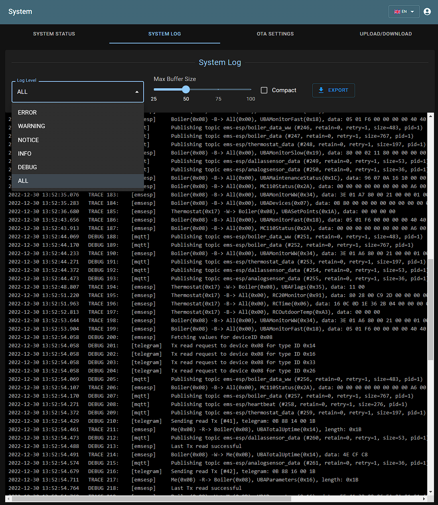
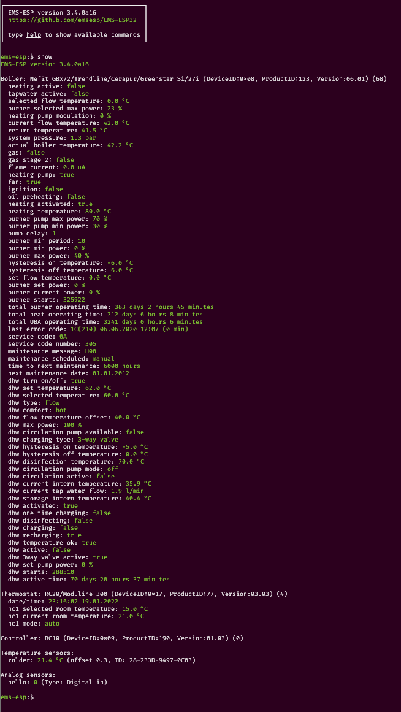

# 

**EMS-ESP** is an open-source firmware for the Espressif ESP8266 and ESP32 microcontroller that communicates with **EMS** (Energy Management System) based equipment from manufacturers like Bosch, Buderus, Nefit, Junkers, Worcester and Sieger.

This project is the specifically for the ESP32. Compared with the previous ESP8266 (version 2) release it has the following enhancements:

- Ethernet Support
- Pre-configured circuit board layouts
- Supports writing EMS values directly from within Web UI
- Mock API server for faster offline development and testing
- Improved API and MQTT commands
- Improvements to Dallas temperature sensors
- Embedded log tracing in the Web UI

If you like **EMS-ESP**, please give it a star, or fork it and contribute!

Note, EMS-ESP requires a small hardware circuit that can convert the EMS bus data to be read by the microcontroller. These can be ordered at <https://bbqkees-electronics.nl> or contact the contributors that can provide the schematic and designs.

---

# **Features**

- A multi-user secure web interface to change settings and monitor incoming data
- A console, accessible via Serial and Telnet for more advanced monitoring
- Native support for Home Assistant and Domoticz via [MQTT Discovery](https://www.home-assistant.io/docs/mqtt/discovery/)
- Can run standalone as an independent WiFi Access Point or join an existing WiFi network
- Easy first-time configuration via a web Captive Portal
- Support for more than [100 EMS devices](https://emsesp.github.io/docs/#/Supported-EMS-Devices) (boilers, thermostats, solar modules, mixer modules, heat pumps, gateways)

## **Demo**

See a demo [here](https://ems-esp.derbyshire.nl). Log in with any username/password.

# **Screenshots**

## Web Interface

|                                    |                                  |
| ---------------------------------- | -------------------------------- |
|  |  |
|   |    |
|      |     |

## Telnet Console

## In Home Assistant

  
# **Installing**

Refer to the [official documentation](https://emsesp.github.io/docs) to how to install the firmware and configure it. The documentation is being constantly updated as new features and settings are added.

You can choose to use an pre-built firmware image or compile the code yourself:

- [Uploading a pre-built firmware build](https://emsesp.github.io/docs/#/Uploading-firmware)
- [Building the firmware from source code and flashing manually](https://emsesp.github.io/docs/#/Building-firmware)

# **Support Information**

If you're looking for support on **EMS-ESP** there are some options available:

## Documentation

- [Official EMS-ESP Documentation](https://emsesp.github.io/docs): For information on how to build and upload the firmware
- [FAQ and Troubleshooting](https://emsesp.github.io/docs/#/Troubleshooting): For information on common problems and solutions. See also [BBQKees's wiki](https://bbqkees-electronics.nl/wiki/gateway/troubleshooting.html)

## Support Community

- [Discord Server](https://discord.gg/3J3GgnzpyT): For support, troubleshooting and general questions. You have better chances to get fast answers from members of the community
- [Search in Issues](https://github.com/emsesp/EMS-ESP32/issues): You might find an answer to your question by searching current or closed issues

## Developer's Community

- [Bug Report](https://github.com/emsesp/EMS-ESP32/issues/new?template=bug_report.md): For reporting Bugs
- [Feature Request](https://github.com/emsesp/EMS-ESP32/issues/new?template=feature_request.md): For requesting features/functions
- [Troubleshooting](https://github.com/emsesp/EMS-ESP32/issues/new?template=questions---troubleshooting.md): As a last resort, you can open new _Troubleshooting & Question_ issue on GitHub if the solution could not be found using the other channels. Just remember: the more info you provide the more chances you'll have to get an accurate answer

# **Contributors ✨**

EMS-ESP is a project originally created and owned by [proddy](https://github.com/proddy). Key contributors are:

<!-- prettier-ignore-start -->
<!-- markdownlint-disable -->
<table>
  <tr>
    <td align="center">
    <a href="https://github.com/MichaelDvP"> <b>MichaelDvP</b></a> </a> <a href="https://github.com/emsesp/EMS-ESP/commits?author=MichaelDvP" title="v2 Commits">v2</a>
    <a href="https://github.com/emsesp/EMS-ESP32/commits?author=MichaelDvP" title="v3 Commits">v3</a>
    </td>

  </tr>
</table>
<!-- markdownlint-restore -->
<!-- prettier-ignore-end -->

You can also contribute to EMS-ESP by

- providing Pull Requests (Features, Fixes, suggestions)
- testing new released features and report issues on your EMS equipment
- contributing to missing [Documentation](https://emsesp.github.io/docs)

# **Libraries used**

- [esp8266-react](https://github.com/rjwats/esp8266-react) by @rjwats for the framework that provides the core of the Web UI
- [uuid-\*](https://github.com/nomis/mcu-uuid-console) from @nomis. The console, syslog, telnet and logging are based off these open source libraries
- [ArduinoJson](https://github.com/bblanchon/ArduinoJson) for JSON
- [AsyncMqttClient](https://github.com/marvinroger/async-mqtt-client) for the MQTT client, with custom modifications from @bertmelis and @proddy
- ESPAsyncWebServer and AsyncTCP for the Web server and TCP backends, with custom modifications for performance

# **License**

This program is licensed under GPL-3.0
