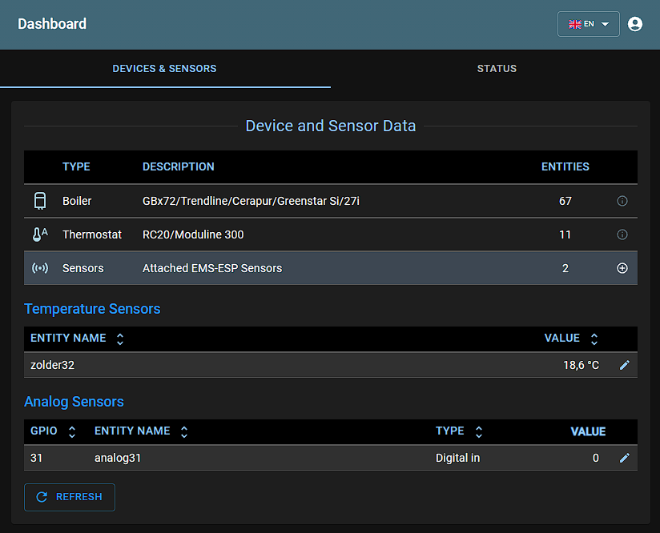
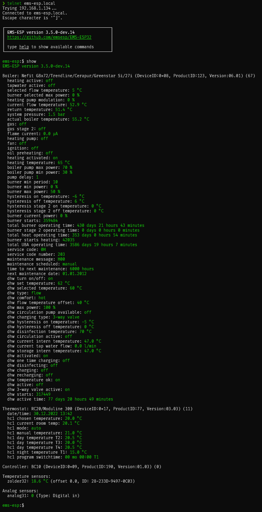

# 

**EMS-ESP** is an open-source firmware for the Espressif ESP32 microcontroller that communicates with **EMS** (Energy Management System) based equipment from manufacturers like Bosch, Buderus, Nefit, Junkers, Worcester and Sieger. It requires a small gateway circuit to interface with the EMS bus which can be purchased from <https://bbqkees-electronics.nl> or custom built.

## **Features**

- A multi-user, multi-language secure web interface to change settings and monitor incoming data
- A console, accessible via Serial and Telnet for more advanced monitoring
- Native support for Home Assistant, Domoticz and openHAB via [MQTT Discovery](https://www.home-assistant.io/docs/mqtt/discovery/)
- Can run standalone as an independent WiFi Access Point or join an existing WiFi network
- Easy first-time configuration via a web Captive Portal
- Support for more than [110 EMS devices](https://emsesp.github.io/docs/#/Supported-EMS-Devices) (boilers, thermostats, solar modules, mixer modules, heat pumps, gateways, switches, heat sources)

## **Documentation**

For the complete documentation on how to install, configure and get support visit the [EMS-ESP Wiki](https://emsesp.github.io/docs).

## **Support**

To chat with the community reach out on our [Discord Server](https://discord.gg/3J3GgnzpyT).

If you like **EMS-ESP**, please give it a star, or fork it and contribute or offer a small donation!

## **Demo**

For a live demo of the Web UI click [here](https://ems-esp.derbyshire.nl) and log in with any username/password.

## **Contributors ✨**

EMS-ESP is a project owned and maintained by [proddy](https://github.com/proddy) and [MichaelDvP](https://github.com/MichaelDvP).

## **Libraries used**

- [esp8266-react](https://github.com/rjwats/esp8266-react) by @rjwats for the framework that provides the core of the Web UI
- [uuid-\*](https://github.com/nomis/mcu-uuid-console) from @nomis. The console, syslog, telnet and logging are based off these open source libraries
- [ArduinoJson](https://github.com/bblanchon/ArduinoJson) for all the JSON
- [espMqttClient](https://github.com/bertmelis/espMqttClient) for the MQTT client, with custom modifications from @MichaelDvP and @proddy
- ESPAsyncWebServer and AsyncTCP for the Web server and TCP backends, with custom modifications for performance

## **License**

This program is licensed under GPL-3.0

## **Screenshots**

### Web Interface

|                                    |                                  |
| ---------------------------------- | -------------------------------- |
|  |  |
|   |    |
|      |     |

### Telnet Console

### In Home Assistant

