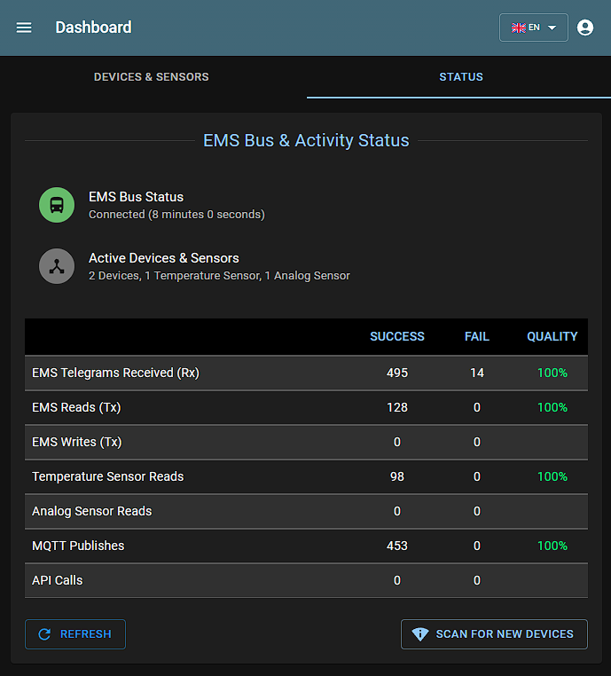
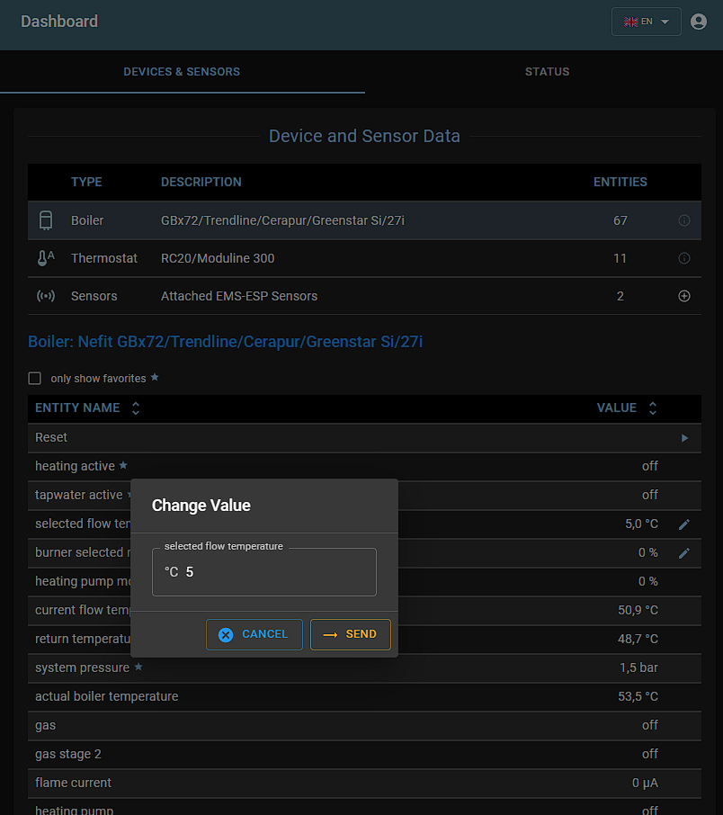

# 

**EMS-ESP** is an open-source firmware for the Espressif ESP32 microcontroller to communicate with **EMS** (Energy Management System) compatible equipment from manufacturers such as Bosch, Buderus, Nefit, Junkers, Worcester, Sieger, elm.leblanc and iVT.

It requires a small circuit to interface with the EMS bus which can be purchased from <https://bbqkees-electronics.nl> or custom built.

## **Key Features**

- Compatible with EMS, EMS+, EMS2, EMS Plus, Logamatic EMS, Junkers 2-wire, Heatronic 3 and 4
- Supporting over 120 different EMS compatible devices such as thermostats, boilers, heat pumps, mixing units, solar modules, connect modules, ventilation units, switches and more
- Easy to add external Temperature and Analog sensors that are attached to GPIO pins on the ESP32 board
- A multi-user, multi-language web interface to change settings and monitor incoming data
- A simple to use console, accessible via Serial/USB or Telnet for advanced operations and detailed monitoring
- Native integration with Home Assistant, Domoticz, openHAB and Modbus
- Easy setup and install with automatic updates
- Simulation of remote thermostats
- Localized to 10 languages, and customizable to rename any device or sensor
- Extendable by adding own custom EMS entities
- Expandable via adding user-built external modules
- A powerful Scheduler to automate tasks and trigger events based data changes
- A Notification service to alert you of important events

## **Installing**

For a quick install of the latest stable release go to [https://install.emsesp.org](https://install.emsesp.org). For other methods of installing and upgrading, and switching over to the development version go to [this section](https://emsesp.org/Getting-Started/#first-time-install) in the documentation.

If you're upgrading a BBQKees Electronics EMS Gateway and unsure which firmware to use, please refer to the [this overview](https://emsesp.org/Getting-Started/#bbqkees-electronics-ems-gateway).

## **Documentation**

Visit [emsesp.org](https://emsesp.org) for more details on how to install and configure EMS-ESP. There is also a collection of Frequently Asked Questions and Troubleshooting tips with example customizations from the community.

## **Getting Support**

To chat with the community reach out on our [Discord Server](https://discord.gg/3J3GgnzpyT).

If you find an issue or have a request, see [here](https://emsesp.org/Support/) on how to submit a bug report or feature request.

## **Live Demo**

For a live demo go to [demo.emsesp.org](https://demo.emsesp.org). Pick a language from the sign on page and log in with any username or password. Note not all features are operational as it's based on static data.

## **Contributors**

EMS-ESP is a project created by [proddy](https://github.com/proddy) and owned and maintained by both [proddy](https://github.com/proddy) and [MichaelDvP](https://github.com/MichaelDvP) with support from [BBQKees Electronics](https://bbqkees-electronics.nl).

You can contact us using [this form](https://emsesp.org/Contact/).

If you like **EMS-ESP**, please give it a ✨ on GitHub, or even better fork it and contribute. You can also offer a small donation. This is an open-source project maintained by volunteers, and your support is greatly appreciated.

## **Libraries used**

- [esp8266-react](https://github.com/rjwats/esp8266-react) by @rjwats for the core framework that provides the Web UI, which has been heavily modified
- [uuid-\*](https://github.com/nomis/mcu-uuid-console) from @nomis. The console, syslog, telnet and logging are based off these awesome open source libraries
- [ArduinoJson](https://github.com/bblanchon/ArduinoJson) for all the JSON processing
- [espMqttClient](https://github.com/bertmelis/espMqttClient) for the MQTT client
- ESPAsyncWebServer and AsyncTCP for the Web server and TCP backends, with custom modifications for performance

## **License**

This program is licensed under GPL-3.0

## **Screenshots**

### Web Interface

|                                    |                                  |
| ---------------------------------- | -------------------------------- |
|  |  |
|   |    |
|      |     |

### Telnet Console

### Home Assistant

