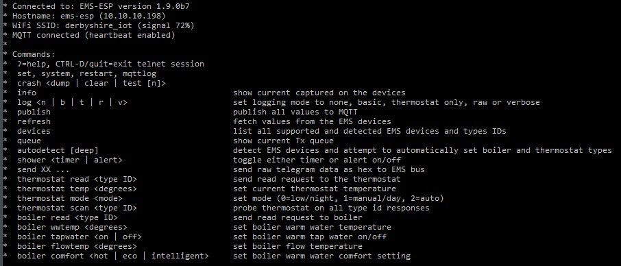
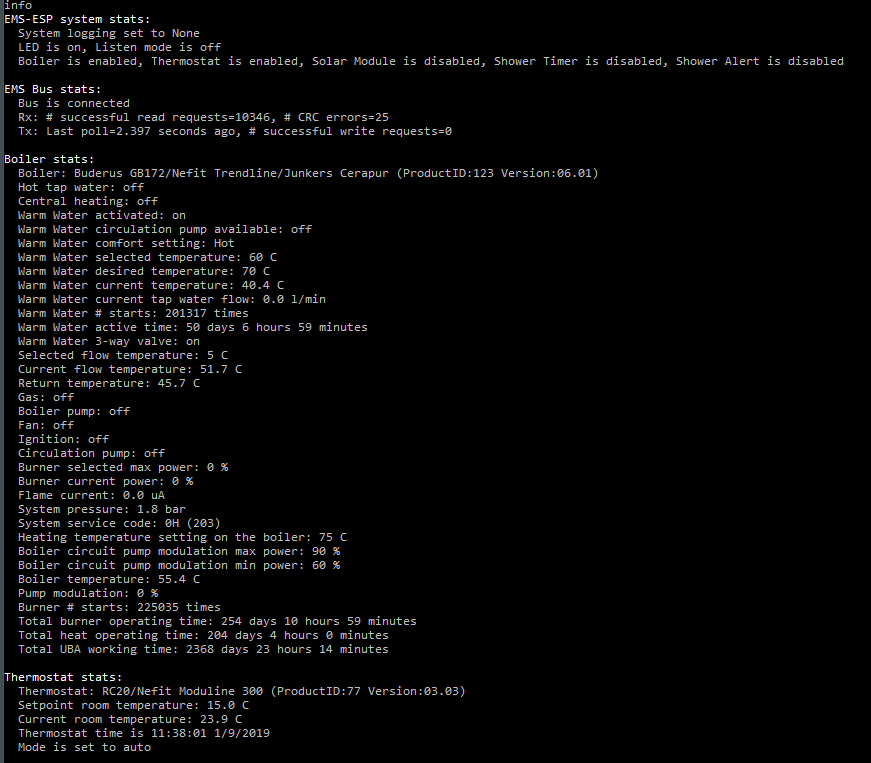

## Using Telnet to monitor EMS traffic

Use the telnet client to inform you of all activity and errors real-time. This is an example of the telnet output:



Type `log v` and Enter and you'll be seeing verbose logging messages. ANSI colors with white text for info messages, green are for broadcast telegrams, yellow are the ones sent to us and red are for unknown data or telegrams which have failed the CRC check.


To see the current stats and collected values type 'info'. Note it is normal behavior to see a few CrcErrors as this is usually noise on the line.



**Warning: be careful when sending values to the boiler. If in doubt you can always reset the boiler to its original factory settings by following the instructions in the user guide. For example on my Nefit Trendline that is done by holding down the Home and Menu buttons simultaneously for a few seconds, selecting factory settings from the scroll menu followed by pressing the Reset button.**

### Recommended puTTY settings

The Telnet code handles continuous motioning of key strokes, which is useful when monitoring a stream of incoming telegrams and issuing commands at the same time. If you're using puTTY then this will be need to be enabled. I suggest the following settings:

```
Terminal->Local line editing->Force off
Terminal->Bell->None
Window->Columns: 180
Window->Rows: 70
Window->Lines of scrollback: 5000
Window->Appearance->Font quality: Antialiased
```


